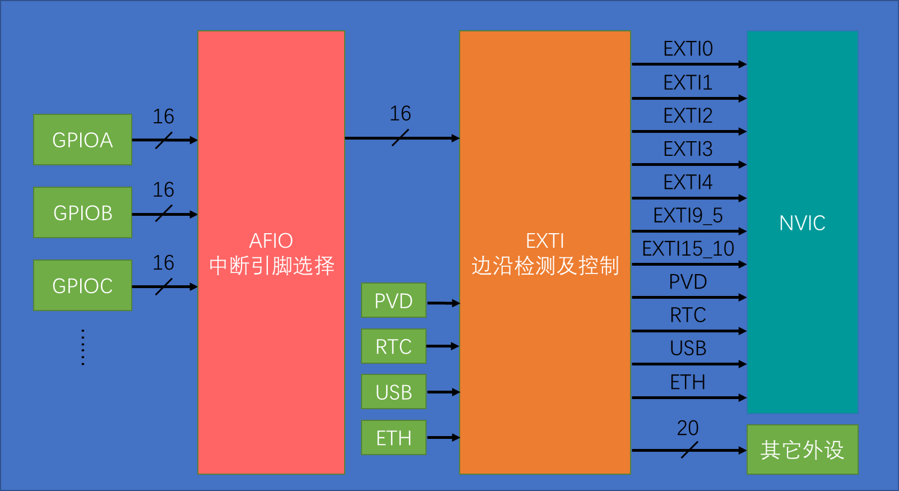
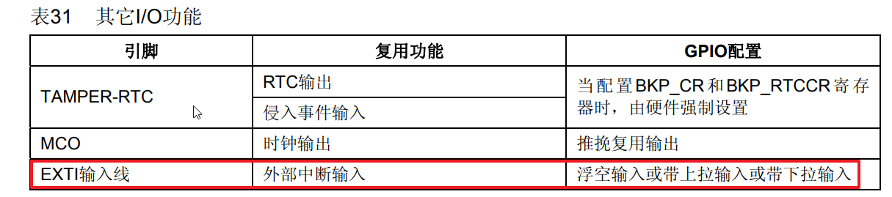
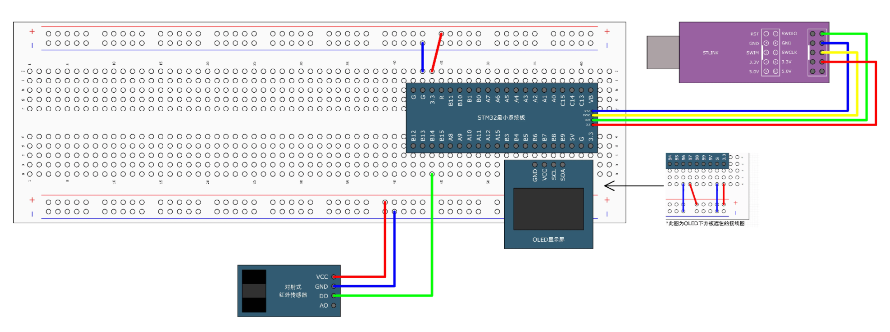

# 一、引言

你是否遇到过以下问题？

- 辛苦编写的STM32电机速度监测代码，数据接收总是丢包？
- 明明设定了相同的电机转速，两轮机器人却无法直线行驶？

本文将基于**实际项目经验**，手把手教你：

1. **精准定位**电机速度监测和串口通信丢包的根本原因
2. 掌握STM32中断外设配置，实现电机速度的精确测量
3. 获取现成可用的**代码模板与调试工具清单**

<aside>
💡为什么需要关注中断？


- 中断机制是计算机系统的核心功能之一，在硬件与操作系统的协同工作中起着关键作用。
- 中断机制采用事件驱动的异步处理方式，实现了**资源高效利用、实时响应、系统稳定性**等重要目标。如果没有中断机制，计算机就只能按顺序执行任务，效率低下，无法满足复杂应用的需求。

---

# **二、中断机制**

## 2.1 什么是中断？

中断是指在主程序运行过程中，当出现特定的触发条件（即中断源）时，CPU 暂停当前执行的程序，转而执行中断程序。处理完中断程序后，CPU 返回原来被暂停的位置继续运行。


*例如，外部中断可由引脚电平变化触发，定时器中断由定时时间到达触发，串口通信中断则在接收数据时触发。这些中断事件通常较为紧急，如不及时处理，可能导致数据丢失或系统错误。使用中断系统能显著提高程序效率，避免主程序不断查询事件。*

## 2.2 中断优先级

当多个中断源同时请求中断时，CPU 会根据轻重缓急进行裁决，优先处理更紧急的中断源，这就是中断优先级的作用。开发者可根据程序设计需求设置中断优先级。STM32 提供多种优先级分类方式，通过合理设置，可确保紧急事件优先处理，避免被其他中断延误。

<aside>
📖 NVIC（嵌套向量中断控制器）统一管理 STM32 的中断，并为每个中断通道分配优先级。每个通道具有 16 个可编程优先等级，还可通过分组设置抢占优先级和响应优先级，为开发者提供灵活的优先级配置方式。


1. **分组原理**：STM32的NVIC通过分组机制实现细致的中断优先级管理。优先级寄存器使用4位二进制数（0-15），表示16个优先级等级，数值越小优先级越高。这4位可分为高n位的抢占优先级和低(4-n)位的响应优先级。
2. **分组方式与优先级规则**：系统提供5种分组方式（0-4）。分组0设置0位抢占优先级（固定为0）和4位响应优先级（0-15）；分组1设置1位抢占优先级（0-1）和3位响应优先级（0-7），依此类推。高抢占优先级的中断可以嵌套执行，高响应优先级的中断在等待时优先处理。当两种优先级相同时，按中断号排序，较小的优先响应。开发者应根据应用需求选择合适的分组方式，并确保优先级设置在有效范围内。

## 2.3 中断嵌套

中断嵌套指一个中断程序运行时，如有更高优先级的中断请求，CPU 会暂停当前中断程序，转而处理新的中断。完成后，再依次返回并继续执行原中断程序。


<aside>
⚠️中断嵌套旨在及时处理紧急中断，其发生条件取决于中断优先级——仅当新中断优先级更高时才会发生嵌套。
</aside>


## **2.4 STM32中断分类**

STM32 的中断资源包括**内核中断**和**外设中断**。

内核中断包括复位中断、NMI不可屏蔽中断等，主要涉及系统底层操作。虽然较难理解，但在一般应用中使用较少。

外设中断则包含各类外设产生的中断，如窗口看门狗用于监测程序运行状态，在程序卡死未及时喂狗时申请中断；PVD电源电压监测在供电不足时产生中断，提醒保存重要数据。本节重点学习的外部中断也属于外设中断的一种。

# 三、外部中断（EXTI）

### **3.1 外部中断基本介绍**

- **外部中断基础功能**

EXTI（ External Interrupt，外部中断 ）主要用于监测指定 GPIO 口的电平变化。当指定的 GPIO 口产生电平变化时，EXTI 会立即向 NVIC 发出中断申请，经 NVIC 裁决后，中断 CPU，使主程序执行 EXTI 对应的中断程序，从而实现对外部事件的及时响应。

- **多样的触发方式**

EXTI 支持多种触发方式，包括上升沿触发（即电平从低电平变为高电平的瞬间触发中断）、下降沿触发（高电平变为低电平的瞬间触发）、双边沿触发（上升沿和下降沿都能触发中断）以及软件触发（通过程序代码执行即可触发中断，即使引脚电平未发生变化）。

- **GPIO 口支持与限制**

EXTI 支持所有的 GPIO 口作为外部中断引脚，但需要注意的是，相同编号的引脚（如 PA0 和 PB0、PA1 和 PB1 等）不能同时用于触发中断。若有多个中断引脚需求，应选择不同编号的引脚，如 PA6 和 PA7、PA9 和 PB15、PB0 和 PB1 等组合。

- **中断通道分配**

外部中断共占用 20 个中断线路，其中 16 个与 GPIO 口对应（即 GPIO0 - GPIO15），另外还包括 PVD 输出、RTC 闹钟、USB 唤醒、以太网唤醒所占用的通道。这 16 个 GPIO 口对应的通道是外部中断的主要功能部分，而后面四个通道主要是借助外部中断的从低功耗模式唤醒功能，实现相应的特殊功能，如电源电压恢复时 PVD 借助外部中断退出停止模式，RTC 闹钟定时到达后唤醒系统等。

- **触发响应方式**

外部中断的触发响应方式分为中断响应和事件响应。中断响应是常见的方式，即申请中断后，CPU 执行中断函数。而事件响应是 STM32 为外部中断增加的特殊功能，当外部中断检测到引脚电平变化时，可选择触发事件。此时，外部中断信号不会通向 CPU，而是通向其他外设，触发如 ADC 转换、DMA 等外设操作，实现外设之间的协同工作，提高系统的整体效率。

### **3.2 外部中断结构解析**

1. **整体架构**：外部中断的整体结构较为复杂，从左到右依次为 GPIO 口外设、AFIO 中断引脚选择电路模块、EXTI 边缘检测及控制电路，最后分为触发中断和触发事件两路输出。GPIO 口外设有多个，每个外设包含 16 个硬件引脚，这些引脚的信号首先进入 AFIO 选择电路。
2. **AFIO 选择电路**：AFIO 主要用于引脚复用功能的选择和定义，在外部中断中，它起到中断引脚选择的关键作用。由于 GPIO 口硬件引脚数量众多，而 EXTI 模块只有 16 个 GPIO 通道，AFIO 通过数据选择器，从多个 GPIO 口的 16 个硬件引脚中选择一个连接到 EXTI 通道，这就解释了为何相同编号的引脚不能同时触发中断。
3. **EXTI 内部电路**：经过 AFIO 选择后的 16 个通道信号与其他 4 个特殊功能信号（PVD 输出、RTC 闹钟、USB 唤醒、以太网唤醒）共同组成 EXTI 的 20 个输入信号，进入 EXTI 边缘检测及控制电路。该电路可选择上升沿、下降沿或双边沿触发，触发信号经过或门后兵分两路。一路用于触发中断，会先设置挂起寄存器，通过与中断屏蔽寄存器共同进入与门，决定是否向 NVIC 中断控制器发送中断信号；另一路用于触发事件，经过事件屏蔽寄存器控制后，通过脉冲发生器触发其他外设操作。



## 3.3 外部中断的配置

**EXTI配置步骤**：

1. 配置时钟
2. 配置GPIO为输入模式（推荐使用**上拉/下拉/浮空**输入）
3. 配置AFIO并选择中断引脚（需与GPIO端口对应）
4. 配置EXTI参数，包括触发方式（上升沿、下降沿或双边沿）和中断总线
5. 配置NVIC优先级并使能中断
6. 向中断函数中添加中断执行程序；



代码示例：

```c
// 中断配置
void CounterSensor_Init(void)
{
	// 开启中断相应的时钟
	RCC_APB2PeriphClockCmd(RCC_APB2Periph_GPIOB, ENABLE); // GPIO时钟
	RCC_APB2PeriphClockCmd(RCC_APB2Periph_AFIO, ENABLE); // AFIO时钟
	// 配置GPIO
	GPIO_InitTypeDef GPIOInitSturcture; // 定义GPIO结构体
	GPIOInitSturcture.GPIO_Mode = GPIO_Mode_IPU; //上拉输入
	GPIOInitSturcture.GPIO_Pin = GPIO_Pin_14; // 使用的GPIO端口
	GPIOInitSturcture.GPIO_Speed = GPIO_Speed_50MHz; // GPIO通讯频率
	GPIO_Init(GPIOB, &GPIOInitSturcture); // GPIO初始化
	// 配置AFIO，中断引脚选择
	GPIO_EXTILineConfig(GPIO_PortSourceGPIOB, GPIO_PinSource14);
	// 配置EXTI
	EXTI_InitTypeDef EXTIInitSturcture;
	EXTIInitSturcture.EXTI_Line = EXTI_Line14;
	EXTIInitSturcture.EXTI_LineCmd = ENABLE;
	EXTIInitSturcture.EXTI_Mode = EXTI_Mode_Interrupt;
	EXTIInitSturcture.EXTI_Trigger = EXTI_Trigger_Rising;
	EXTI_Init(&EXTIInitSturcture);
	
	NVIC_PriorityGroupConfig(NVIC_PriorityGroup_2);
	NVIC_InitTypeDef NVICInitSturcture;
	NVICInitSturcture.NVIC_IRQChannel = EXTI15_10_IRQn;
	NVICInitSturcture.NVIC_IRQChannelCmd = ENABLE;
	NVICInitSturcture.NVIC_IRQChannelPreemptionPriority = 1;
	NVICInitSturcture.NVIC_IRQChannelSubPriority = 1;
	NVIC_Init(&NVICInitSturcture);
	
}
// 中断函数
void EXTI15_10_IRQHandler(void)
{
	if (EXTI_GetITStatus(EXTI_Line14) == SET)
	{
		
		EXTI_ClearITPendingBit(EXTI_Line14); //清除中断标志位
	}
}
```

<aside>
⏰中断函数的编写


1. **清除中断标志**：强调必须在ISR中清除标志位（如`__HAL_GPIO_EXTI_CLEAR_IT()`）。
2. **避免阻塞操作**：禁止在ISR中使用`HAL_Delay()`或长时间循环。
3. **中断通信技巧**：使用全局变量或信号量（如 FreeRTOS 的`xSemaphoreGiveFromISR()`）传递数据。
4. 避免和主函数操作同一硬件。

## **3.4 外部中断适用场景**

<aside>
📢 外部中断最适合处理外部驱动的快速突发信号。


**以旋转编码器为例：**当不旋转时，STM32无需处理；一旦旋转就会产生大量高速脉冲波形。如果STM32不能及时读取，就会错过关键信息。使用外部中断可以在脉冲到来时立即处理，而在无脉冲时让STM32执行其他任务。

另一个典型例子是红外遥控接收头，它接收到遥控数据后会输出瞬时波形，同样需要外部中断来快速捕获。不过，对于按键输入，虽然也属于外部驱动的突发事件，但不建议使用外部中断读取，因为外部中断难以处理按键抖动和松手检测。对于要求不高的按键处理，可以在主程序中循环读取；如果需要实现后台读取且不阻塞主程序，可以考虑使用定时器中断方式。

# 四、小试牛刀

<aside>
🛠 实验环境


- 硬件：`STM32F10C8T6开发板 + ST-LINK模块 + 对射式红外传感器 + OLED显示屏`
- 软件：`Keil5`
- 依赖库：`STM32标准库`



代码实现：

```c
// 中断配置
#include "stm32f10x.h"                  // Device header

uint16_t CounterSensor_count;

void CounterSensor_Init(void)
{
	RCC_APB2PeriphClockCmd(RCC_APB2Periph_GPIOB, ENABLE);
	RCC_APB2PeriphClockCmd(RCC_APB2Periph_AFIO, ENABLE);
	
	GPIO_InitTypeDef GPIOInitSturcture;
	GPIOInitSturcture.GPIO_Mode = GPIO_Mode_IPU;
	GPIOInitSturcture.GPIO_Pin = GPIO_Pin_14;
	GPIOInitSturcture.GPIO_Speed = GPIO_Speed_50MHz;
	GPIO_Init(GPIOB, &GPIOInitSturcture);
	
	GPIO_EXTILineConfig(GPIO_PortSourceGPIOB, GPIO_PinSource14);
	
	EXTI_InitTypeDef EXTIInitSturcture;
	EXTIInitSturcture.EXTI_Line = EXTI_Line14;
	EXTIInitSturcture.EXTI_LineCmd = ENABLE;
	EXTIInitSturcture.EXTI_Mode = EXTI_Mode_Interrupt;
	EXTIInitSturcture.EXTI_Trigger = EXTI_Trigger_Rising;
	EXTI_Init(&EXTIInitSturcture);
	
	NVIC_PriorityGroupConfig(NVIC_PriorityGroup_2);
	NVIC_InitTypeDef NVICInitSturcture;
	NVICInitSturcture.NVIC_IRQChannel = EXTI15_10_IRQn;
	NVICInitSturcture.NVIC_IRQChannelCmd = ENABLE;
	NVICInitSturcture.NVIC_IRQChannelPreemptionPriority = 1;
	NVICInitSturcture.NVIC_IRQChannelSubPriority = 1;
	NVIC_Init(&NVICInitSturcture);
	
}

uint16_t CounterSensor_Count_GET(void)
{
	return CounterSensor_count;
}

void EXTI15_10_IRQHandler(void) //中断函数
{
	if (EXTI_GetITStatus(EXTI_Line14) == SET)
	{
		/*出现数据乱跳的现象，可再次判断引脚电平，以避免抖动*/
		if (GPIO_ReadInputDataBit(GPIOB, GPIO_Pin_14) == 0)
		{
			CounterSensor_count ++;
		}
		EXTI_ClearITPendingBit(EXTI_Line14);
	}
}

#include "stm32f10x.h"                  // Device header
#include "Delay.h"
#include "OLED.h"
#include "CounterSensor.h"

int main(void)
{

	OLED_Init();
	CounterSensor_Init();
	OLED_ShowString(1, 1, "Count:");
	
	while(1){
		OLED_ShowNum(1, 7, CounterSensor_Count_GET(), 5);
	}
}

```

<aside>
📢 实验现象


下载程序后，每当红外传感器被遮挡一次，OLED显示屏上的"number"数值就会自动加1。程序通过红外传感器的状态变化触发外部中断，在中断函数中执行"number++"计数操作，并将结果实时显示在OLED上。
