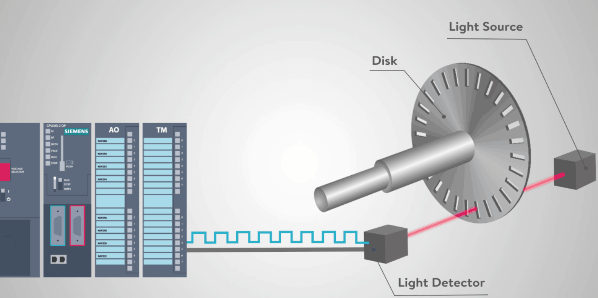
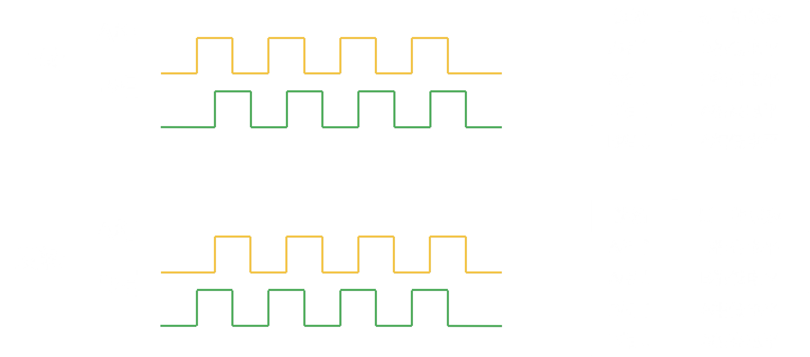
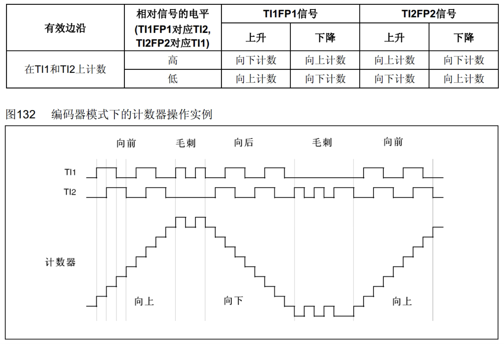
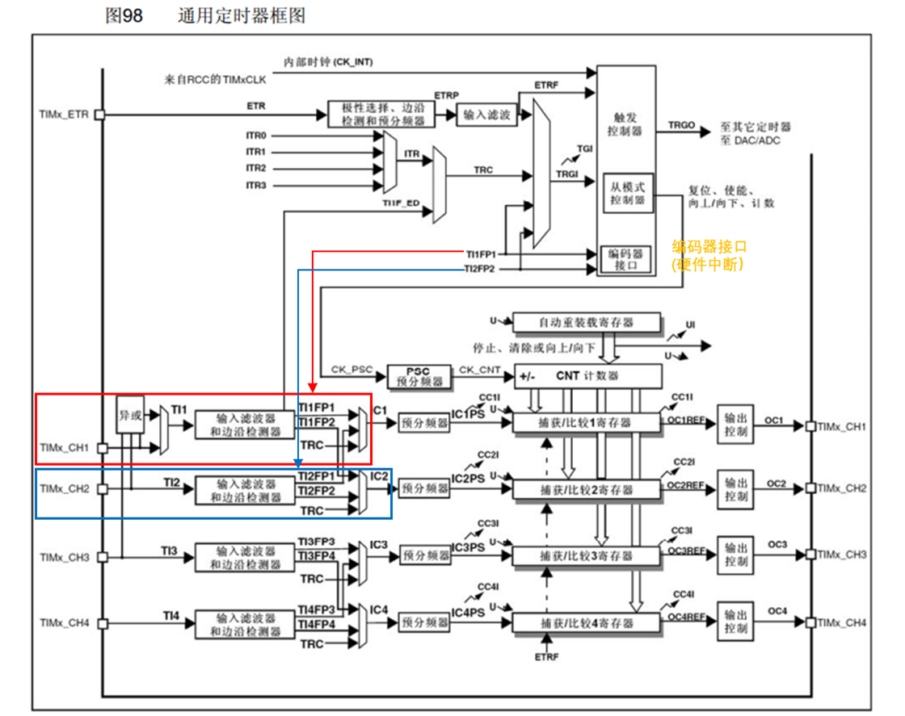
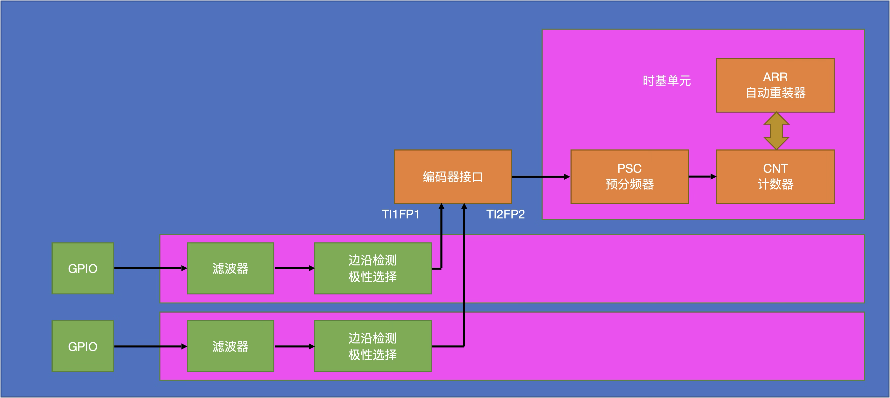
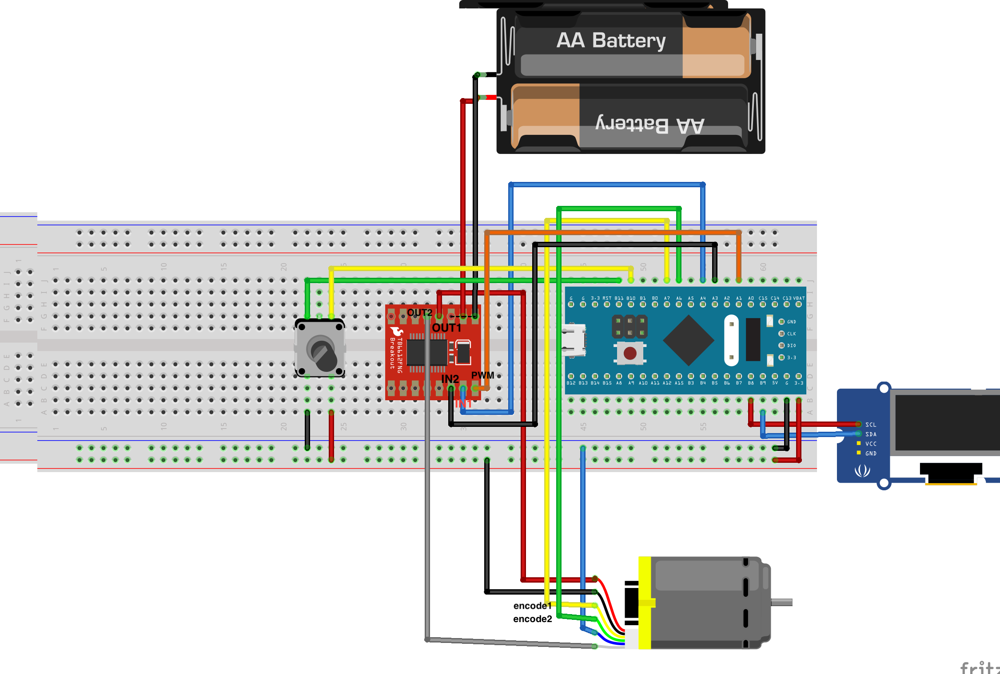

# 一、引言

在电机控制领域，实现精准的速度控制离不开编码器的帮助，怎么用STM32自带的编码器接口实现对电机速度的测量？

本文将基于**实际项目经验**，手把手教你：

1. 利用STM32编码器接口实现对电机转速的测量；
2. 结合**旋转编码器**和**编码器**实现电机速度的**开环控制，**获取现成可用的**工程代码**

# 二、编码器

## 2.1 什么是编码器?

编码器是一种将角位移或直线位移转换成电信号的传感器。在电机控制中，编码器通常安装在电机轴上，用于测量电机的转速和位置。



## 2.2 编码器的分类和工作原理

**按工作原理分类:**

- **光电编码器:** 利用光电效应，通过光栅盘和光电传感器将位移转换成电信号。具有精度高、响应快的特点。
- **磁电编码器:** 利用磁阻效应或霍尔效应，通过磁栅和磁传感器将位移转换成电信号。具有结构简单、抗干扰能力强的特点。

**按输出信号分类:**

- **增量式编码器:** 输出脉冲信号，通过计数脉冲数来计算位移和速度。需要参考点来确定绝对位置。
- **绝对式编码器:** 输出绝对位置信息，每个位置对应唯一的编码。无需参考点即可确定绝对位置。

**霍尔编码器的测速原理**

- 通过磁性转盘和霍尔传感器生成脉冲，正交信号（A/B相相差90°）判断方向。速度计算需结合每转脉冲数（CPR）和采样时间。



<aside>
❓ 编码器时如何判断方向与计数？

由于A/B相的信号总是相差90°，假如选择A相上升沿触发中断，当码盘正转时，B相为低电平；反转时，B相则为高电平，如此，即可通过B相的电平高低来判断码盘的旋转方向

至于旋转角度及速度则可以通过对A/B相的上升沿计数来实现。例如，码盘旋转一圈，编码器会输出360个上升沿，通过计数就可以知道旋转角度；计算每分钟码盘旋转的角度，就可以知道转速

# 三、定时器编码器接口

## 3.1 编码器接口原理

编码器接口实际上是一种硬件中断，当GPIO输入正交编码器的信号符合条件，触发中断，按照预定模式实现CNT的自增或者自减，以达到获取编码器位置、旋转方向及旋转速度的目的。

如下图中，当TI1上升沿时，TI2低电平时，计数器向上计数；当编码器旋转方向改变时，TI2信号发生了翻转，当TI1上升沿时，TI2为高电平，计数器向下计数。

此外，编码器还具有一定的抗干扰能力，在中间的毛刺阶段，TI1信号出现了锯齿波动，由于TI2的信号未发生改变，实际计数器计数值则处于自稳定状态。



> STM32每个高级定时器和通用定时器都拥有1个编码器接口

## 3.2 编码器接口结构

编码器接口的两个输入引脚借用了输入捕获的通道1和通道2，通道3和通道4不能接编码器；GPIO接口输入信号经滤波器可以滤掉信号的一些毛刺，边沿检测器极性选择则决定是否对信号进行反相操作



编码器接口工作时不会使用72MHz内部时钟和时基单元初始化时设置的计数方向，此时计数时钟和计数方向均处于编码器接口托管的状态，计数器的自增和自减受编码器控制



## 3.3 编码器接口的配置

编码器接口工作涉及GPIO、时基单元、编码器接口、输入捕获

1. 开启时钟（TIM、GPIO）并配置时钟模式；
2. GPIO初始化及参数配置；
3. 时基单元初始化及参数配置；
4. 输入捕获单元初始化及参数配置（滤波器与极性选择）；
5. 配置编码器接口；
6. 定时器中断使能开启；

# 四、补码操作

## 4.1 什么是补码操作？

补码（Two's Complement）是计算机中表示有符号整数的一种二进制编码方式，**主要用于简化加减法运算**（计算机的运算器只有加法运算器，没有减法运算器），并统一处理正负数的运算逻辑；原码、反码、补码的产生过程就是**为了解决计算机做减法和引入符号位的问题**。

> 补码通过将负数转换为等效的正数加法形式，使得计算机能够用同一套电路处理所有整数运算。其核心思想是**模运算**（溢出自动舍弃高位），确保了运算的高效性和正确性

## **4.2 补码的定义**

- **正数的补码**：与其原码（直接二进制形式）相同

  **示例**：十进制数 `+5` 的8位补码为 `00000101`

- **负数的补码**：

  1. 先写出该负数绝对值的原码；

  2. 按位取反（得到反码）；

  3. 最后加1

     **示例**：十进制数 `-5` 的补码计算：

  - 绝对值原码：`00000101`
  - 按位取反：`11111010`
  - 加1：`11111011` → 即 `5` 的8位补码

## **4.3 补码的核心优势**

- **统一加减法运算**：减法可转换为加法（`A - B = A + (-B)`），无需额外硬件处理符号位。

  **示例**：计算 `5 - 3` → 转换为 `5 + (-3)`：

  - `5` 的补码：`00000101`
  - `3` 的补码：`11111101`
  - 相加结果：`(1)00000010`（进位溢出被舍弃）→ 结果为 `2`。

- **消除双零问题**：原码和反码中存在 `+0` 和 `0`，补码中零仅一种表示（全0）。

- **符号位参与运算**：最高位既是符号位（0正1负），也参与数值计算。

## **4.4 补码的表示范围**

- **n位补码**的范围为：

  - **2**(n-1)** 到 **2**(n-1) - 1**

  **示例**：

  - 8位补码：-128（`10000000`）到 +127（`01111111`）。
  - 16位补码：-32768 到 +32767。

## **4.5 补码与原码的转换**

- **补码 → 原码**：

  1. 若最高位为0（正数），原码与补码相同；

  2. 若最高位为1（负数），按位取反后加1。

     **示例**：补码 `11111011`（-5）：

  - 取反：`00000100`
  - 加1：`00000101` → 原码为 `10000101`（符号位恢复）。

## **4.6 为什么计算机使用补码？**

- **运算高效**：无需区分正负数，直接进行二进制加法。
- **硬件简化**：只需加法器即可完成加减法，降低电路复杂度。
- **统一表示**：消除双零问题，逻辑一致性更强。

# 五、小试牛刀

程序：TIM编码器接口测量电机速度

期望结果：电机速度跟随旋转编码器旋钮的旋转角度方向同步变化；同时，OLED显示旋转编码器旋转角度与编码器接口同步测量的电机速度

<aside>
🛠 实验环境

- 硬件：`STM32F10C8T6开发板 + ST-LINK模块 + OLED显示屏 + 编码器电机 + 旋转编码器 + TB6612电机驱动`
- 软件：`Keil5 + VSCode`
- 依赖库：`STM32标准库`

电路布局：



实现思路：

1. 外部中断实现旋转编码器的方向计数

```c
#include "stm32f10x.h"                  // Device header

int16_t Num; 

void RotaryEncoder_Init(void)
{
	RCC_APB2PeriphClockCmd(RCC_APB2Periph_GPIOB, ENABLE);
	RCC_APB2PeriphClockCmd(RCC_APB2Periph_AFIO, ENABLE);
	
	GPIO_InitTypeDef GPIOInitSturcture;
	GPIOInitSturcture.GPIO_Mode = GPIO_Mode_IPU;
	GPIOInitSturcture.GPIO_Pin = GPIO_Pin_10 | GPIO_Pin_11;
	GPIOInitSturcture.GPIO_Speed = GPIO_Speed_50MHz;
	GPIO_Init(GPIOB, &GPIOInitSturcture);
	
	GPIO_EXTILineConfig(GPIO_PortSourceGPIOB, GPIO_PinSource10);
	
	EXTI_InitTypeDef EXTIInitSturcture;
	EXTIInitSturcture.EXTI_Line = EXTI_Line10;
	EXTIInitSturcture.EXTI_LineCmd = ENABLE;
	EXTIInitSturcture.EXTI_Mode = EXTI_Mode_Interrupt;
	EXTIInitSturcture.EXTI_Trigger = EXTI_Trigger_Rising;
	EXTI_Init(&EXTIInitSturcture);
	
	NVIC_PriorityGroupConfig(NVIC_PriorityGroup_2);
	NVIC_InitTypeDef NVICInitSturcture;
	NVICInitSturcture.NVIC_IRQChannel = EXTI15_10_IRQn;
	NVICInitSturcture.NVIC_IRQChannelCmd = ENABLE;
	NVICInitSturcture.NVIC_IRQChannelPreemptionPriority = 1;
	NVICInitSturcture.NVIC_IRQChannelSubPriority = 1;
	NVIC_Init(&NVICInitSturcture);
}

int16_t EncoderNum_Get(void)
{
	return Num;
}

void EXTI15_10_IRQHandler(void)
{
	if (EXTI_GetITStatus(EXTI_Line10) == SET)
	{
		//if (GPIO_ReadInputDataBit(GPIOB, GPIO_Pin_10) == 1) //�����ж�ȥ�����ݶ���
		//{
		if (GPIO_ReadInputDataBit(GPIOB, GPIO_Pin_11) == 0) 
		{
			Num --;
		}
		else
		{
			Num ++;
		}
		//}
		EXTI_ClearITPendingBit(EXTI_Line10); //����жϱ�־λ
	}
}
```

1. TIM2的输出比较功能实现PWM输出，定时中断进行1s定时（1s测一次电机速度）

```c
#include "stm32f10x.h"                  // Device header
#include "Timer.h"

void PWM_Init(void)
{
	/*配置GPIO*/
	RCC_APB2PeriphClockCmd(RCC_APB2Periph_GPIOA, ENABLE); 
	GPIO_InitTypeDef GPIO_InitStructure;
	GPIO_InitStructure.GPIO_Mode = GPIO_Mode_AF_PP; // 复用推挽输出
	GPIO_InitStructure.GPIO_Pin = GPIO_Pin_1;
	GPIO_InitStructure.GPIO_Speed = GPIO_Speed_50MHz;
	GPIO_Init(GPIOA, &GPIO_InitStructure);
	
	// 配置timer2时钟
	RCC_APB1PeriphClockCmd(RCC_APB1Periph_TIM2, ENABLE);
	//TIM_ETRClockMode2Config(TIM2, TIM_ExtTRGPSC_OFF, TIM_ExtTRGPolarity_NonInverted, 0x04); // TIM�ⲿʱ��ģʽ2->GPIO
	TIM_InternalClockConfig(TIM2);// TIM内部时钟配置
	
	/* ʱ����Ԫ��ʼ��:PWM频率为10000hz*/
	TIM_TimeBaseInitTypeDef TimerInitStructure;
	TimerInitStructure.TIM_ClockDivision = TIM_CKD_DIV1; // 不分频
	TimerInitStructure.TIM_CounterMode = TIM_CounterMode_Up; // 向上计数
	TimerInitStructure.TIM_Period = 100 - 1;
	TimerInitStructure.TIM_Prescaler = 7200 - 1;
	TimerInitStructure.TIM_RepetitionCounter = 0;
	TIM_TimeBaseInit(TIM2, &TimerInitStructure);
	
	/* 定时中断开启*/
	TIM_ITConfig(TIM2, TIM_IT_Update, ENABLE); 
	
	/* NVIC配置*/
	NVIC_PriorityGroupConfig(NVIC_PriorityGroup_2);
	NVIC_InitTypeDef NVIC_InitSturcture;
	NVIC_InitSturcture.NVIC_IRQChannel = TIM2_IRQn;
	NVIC_InitSturcture.NVIC_IRQChannelCmd = ENABLE;
	NVIC_InitSturcture.NVIC_IRQChannelPreemptionPriority = 1;
	NVIC_InitSturcture.NVIC_IRQChannelSubPriority = 2;
	NVIC_Init(&NVIC_InitSturcture);
	
	
	// TIM输出比较配置，用于电机速度控制
	TIM_OCInitTypeDef TIM_OCInitStructure;
	TIM_OCStructInit(&TIM_OCInitStructure);
	TIM_OCInitStructure.TIM_OCMode = TIM_OCMode_PWM1;
	TIM_OCInitStructure.TIM_OCPolarity = TIM_OCPolarity_High;
	TIM_OCInitStructure.TIM_OutputState = TIM_OutputState_Enable;	//输出比较使能开启
	TIM_OCInitStructure.TIM_Pulse = 0;
	TIM_OC2Init(TIM2, &TIM_OCInitStructure);
	
	/*TIM使能开启*/
	TIM_Cmd(TIM2, ENABLE);
}

void TIM2_IRQHandler(void) // 每1s计算一次电机速度
{
	if (TIM_GetITStatus(TIM2, TIM_IT_Update) == SET) //检查指定的TIM中断发生与否:TIM 中断源
    {
		Time_Count ++;
		if (Time_Count>100)
		{
			speed = Encoder_Speed_Get();
			Time_Count = 0;
		}
    }
	TIM_ClearITPendingBit(TIM2, TIM_IT_Update);  //清除TIMx的中断待处理位:TIM 中断源
	
}
```

1. TIM3编码器接口实现对电机速度的测量

```c
#include "stm32f10x.h"                  // Device header

int16_t TIM3_Circle_Count;

void Encoder_Init(void)
{
	// GPIO时钟及TIM3时钟开启
	RCC_APB2PeriphClockCmd(RCC_APB2Periph_GPIOA, ENABLE); 
	RCC_APB1PeriphClockCmd(RCC_APB1Periph_TIM3, ENABLE);
	//RCC_APB2PeriphClockCmd(RCC_APB2Periph_AFIO,ENABLE); 
	
	// GPIO配置
	GPIO_InitTypeDef GPIO_InitStructure;
	GPIO_InitStructure.GPIO_Mode = GPIO_Mode_IN_FLOATING; // GPIO_Mode_IN_FLOATING;
	GPIO_InitStructure.GPIO_Pin = GPIO_Pin_6 | GPIO_Pin_7;
	GPIO_InitStructure.GPIO_Speed = GPIO_Speed_50MHz;
	GPIO_Init(GPIOA, &GPIO_InitStructure);
	
	// 时基单元配置
	TIM_TimeBaseInitTypeDef TIM_TimeBaseInitStructure;
	TIM_TimeBaseInitStructure.TIM_ClockDivision = TIM_CKD_DIV1;
	TIM_TimeBaseInitStructure.TIM_Prescaler = 1 - 1;
	TIM_TimeBaseInitStructure.TIM_CounterMode = TIM_CounterMode_Up;
	TIM_TimeBaseInitStructure.TIM_Period = 65535 -1;
	TIM_TimeBaseInitStructure.TIM_RepetitionCounter = 0;
	TIM_TimeBaseInit(TIM3, &TIM_TimeBaseInitStructure);
	
	// 输入捕获配置
	TIM_ICInitTypeDef TIM_ICInitStructure;
	TIM_ICStructInit(&TIM_ICInitStructure);
	
	TIM_ICInitStructure.TIM_Channel = TIM_Channel_1;
	TIM_ICInitStructure.TIM_ICFilter = 0x10;
	TIM_ICInit(TIM3, &TIM_ICInitStructure);
	
	TIM_ICInitStructure.TIM_Channel = TIM_Channel_2;
	TIM_ICInitStructure.TIM_ICFilter = 0x10;
	TIM_ICInit(TIM3, &TIM_ICInitStructure);
	
	// 编码器接口配置
	TIM_EncoderInterfaceConfig(TIM3, TIM_EncoderMode_TI12, TIM_ICPolarity_Rising, TIM_ICPolarity_Rising);

	// NVIC中断配置
	NVIC_InitTypeDef NVIC_InitStructure;
    NVIC_InitStructure.NVIC_IRQChannel = TIM3_IRQn;                                  
    NVIC_InitStructure.NVIC_IRQChannelPreemptionPriority = 0;    
    NVIC_InitStructure.NVIC_IRQChannelSubPriority = 0;                   
    NVIC_InitStructure.NVIC_IRQChannelCmd = ENABLE;                               
    NVIC_Init(&NVIC_InitStructure);

	TIM_ClearITPendingBit(TIM3, TIM_IT_Update  );//清除中断和捕获标志位
	TIM_ITConfig(TIM3, TIM_IT_Update, ENABLE);
	TIM_ClearFlag(TIM3, TIM_FLAG_Update);
	// TIM3中断使能开启
	TIM_SetCounter(TIM3,0);
	TIM_Cmd(TIM3, ENABLE);	
}

int16_t Encoder_Speed_Get(void)
{
		uint16_t value_1;
    int16_t value_2;
    value_1=TIM_GetCounter(TIM3);//获取当前计数值
    TIM_SetCounter(TIM3,0);//将当前计数值清零
    value_2 = TIM3_Circle_Count;//获取溢出次数
    TIM3_Circle_Count = 0;//溢出次数清零
		return value_1 + value_2*65535;//计算总计数值
}

void TIM3_IRQHandler()
{
    if (TIM_GetITStatus(TIM3, TIM_IT_Update) != RESET)  //判断如果是定时器溢出中断
	{
				//DIR==0，判断当前计数方向，如果是向上计数表示正转，则溢出次数++		
        if((((TIM3->CR1)>>4) & 0x01)==0) TIM3_Circle_Count++;
				//DIR==1，向下计数表示反转，溢出次数--
				else                            TIM3_Circle_Count--;
	}
    TIM_ClearITPendingBit(TIM3, TIM_IT_Update  ); //清除中断标志
}
```

# 六、参考资料

1. [江科大STM32入门教程](https://www.bilibili.com/video/BV1th411z7sn/?spm_id_from=333.337.search-card.all.click)
2. STM32F10xxx参考手册
3. STM32F103xx固件函数库用户手册
4. [二进制数的原码、反码、补码（详解）](https://blog.csdn.net/u011429167/article/details/129264625)
5. [【视频】补码怎么来的？](https://www.bilibili.com/video/BV16U4y1t7LD/?spm_id_from=333.337.search-card.all.click&vd_source=7fed059ba9905c28f73d20ac51cfd427)
