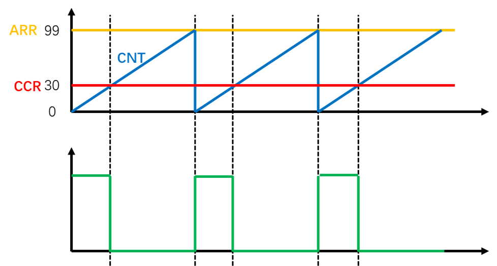

# 一、引言

在嵌入式的应用中，如数字信号控制的LED只有完全亮与灭两种状态，怎么能实现控制亮度大小呢？

本文将基于**实际项目经验**，手把手教你：

1. 利用STM32定时器实现PWM输出，等效输出模拟量；
2. **实现**电机速度的**无级调节，**获取现成可用的**工程代码**

# 二、PWM

## 2.1 什么是PWM?

PWM 全称Pulse Width Modulation，脉冲宽度调制。其利用微处理器的数字输出来对模拟电路进行控制的一种非常有效的技术。在具有惯性的系统中，可以通过对一系列脉冲的宽度进行调制，来等效地获得所需要的模拟参量，常应用于电机控速等领域。

<aside>
❓ 什么是惯性系统呢？

惯性系统具有迟滞性。如LED在熄灭的时候，由于余晖和人眼视觉暂留的现象，LED不会立马熄灭，而是有一定的惯性，过了一小段时间才熄灭的。再如电机在断电后，速度并不会马上为0，由当前速度降为0有一个过程。

## 2.2 PWM基本参数

- **频率**：是指1秒钟内信号从高电平到低电平再回到高电平的次数(一个周期)，也就是说一秒钟PWM有多少个周期

  $$
  f=\frac{1}{T_s}
  $$

- **占空比**：是一个脉冲周期内，高电平的时间与整个周期时间的比例，占空比决定了PWM等效出来的模拟电压的大小，占空比越大，模拟电压越趋近于高电平

$$
占空比=\frac{T_{on}}{T_s}
$$

- **分辨率**：就是占空比**变化的快慢**，**占空比变化的步距**。占空比跳的快如按照1%跳变与按照0.1%跳变，那么0.1%的跳变就越细腻，越柔和


<aside>
⚠️ 具有惯性的系统才能使用PWM


## 2.3 PWM核心思想

比如利用PWM调节LED亮度，就是让LED不断地点亮、熄灭、点亮、熄灭...，当这个点亮熄灭的频率足够大时，LED就不会闪烁了，而是呈现出一个中等的亮度。**调控高低电平的比例**时，就能模拟出不同**亮度级别**。这也是PWM的基本思想

# 三、定时器输出PWM

## 3.1 通用定时器的输出比较通道


## 3.2 输出比较模式

| **模式**                                                     | **描述**                                                     |
| ------------------------------------------------------------ | ------------------------------------------------------------ |
| 冻结                                                         | CNT=CCR时，REF保持为原状态                                   |
| 匹配时置有效电平                                             | CNT=CCR时，REF置有效电平                                     |
| 匹配时置无效电平                                             | CNT=CCR时，REF置无效电平                                     |
| 匹配时电平翻转                                               | CNT=CCR时，REF电平翻转                                       |
| 强制为无效电平                                               | CNT与CCR无效，REF强制为无效电平                              |
| 强制为有效电平                                               | CNT与CCR无效，REF强制为有效电平                              |
| PWM模式1                                                     | 向上计数：CNT<CCR时，REF置有效电平，CNT≥CCR时，REF置无效电平 |
| 向下计数：CNT>CCR时，REF置无效电平，CNT≤CCR时，REF置有效电平 |                                                              |
| PWM模式2                                                     | 向上计数：CNT<CCR时，REF置无效电平，CNT≥CCR时，REF置有效电平 |
| 向下计数：CNT>CCR时，REF置有效电平，CNT≤CCR时，REF置无效电平 |                                                              |

## 3.3 TIM输出PWM

输出比较可以通过比较CNT与CCR寄存器值的关系，来对输出电平进行置1、置0或翻转的操作，从而实现输出一定频率和占空比的PWM波形



PWM频率：

$$
Freq=\frac{CK\_PSC}{(PSC+1)(ARR+1)}
$$

PWM占空比：

$$
Duty = \frac{CCR}{ARR+1}
$$

PWM分辨率：

$$
Reso=\frac{1}{ARR+1}
$$

## 3.4 PWM结构及配置

输出PWM的部分由时基单元、输出比较单元、GPIO构成


PWM配置步骤：

1. 开启时钟（TIM、GPIO）并配置时钟模式；
2. 时基单元初始化及参数配置；
3. 输出比较单元初始化及参数配置；
4. GPIO初始化及参数配置；
5. 定时器中断使能开启；

# 四、小试牛刀

程序：旋转编码器控制电机速度

期望结果：电机速度跟随旋转编码器旋钮的旋转角度方向同步变化；同时，OLED显示编码器旋转角度与当前电机速度

<aside>
🛠 实验环境

- 硬件：`STM32F10C8T6开发板 + ST-LINK模块 + OLED显示屏 + 直流电机 + 旋转编码器 + drv8833电机驱动`
- 软件：`Keil5`
- 依赖库：`STM32标准库`

电路布局：


代码实现：

```c
#include "stm32f10x.h"                  // Device header
#include "Delay.h"
#include "OLED.h"
#include "RotaryEncoder.h"
#include "Motor.h"

int main(void)
{

	OLED_Init();
	RotaryEncoder_Init();
	Motor_Init();
	OLED_ShowString(1, 1, "Count:");
	
	while(1){
		OLED_ShowSignedNum(1, 7, EncoderNum_Get(), 5); // 旋转编码器旋转值记录
		MotorSpeed_Set(EncoderNum_Get()); // 设置电机速度
	}
}

/*-----------------------旋转编码器配置：RotaryEncoder.c------------------------*/
#include "stm32f10x.h"                  // Device header

int16_t Num; 

void RotaryEncoder_Init(void)
{
	RCC_APB2PeriphClockCmd(RCC_APB2Periph_GPIOB, ENABLE);
	RCC_APB2PeriphClockCmd(RCC_APB2Periph_AFIO, ENABLE);
	
	GPIO_InitTypeDef GPIOInitSturcture;
	GPIOInitSturcture.GPIO_Mode = GPIO_Mode_IPU;
	GPIOInitSturcture.GPIO_Pin = GPIO_Pin_0 | GPIO_Pin_1;
	GPIOInitSturcture.GPIO_Speed = GPIO_Speed_50MHz;
	GPIO_Init(GPIOB, &GPIOInitSturcture);
	
	GPIO_EXTILineConfig(GPIO_PortSourceGPIOB, GPIO_PinSource0);
	
	EXTI_InitTypeDef EXTIInitSturcture;
	EXTIInitSturcture.EXTI_Line = EXTI_Line0;
	EXTIInitSturcture.EXTI_LineCmd = ENABLE;
	EXTIInitSturcture.EXTI_Mode = EXTI_Mode_Interrupt;
	EXTIInitSturcture.EXTI_Trigger = EXTI_Trigger_Rising;
	EXTI_Init(&EXTIInitSturcture);
	
	NVIC_PriorityGroupConfig(NVIC_PriorityGroup_2);
	NVIC_InitTypeDef NVICInitSturcture;
	NVICInitSturcture.NVIC_IRQChannel = EXTI0_IRQn;
	NVICInitSturcture.NVIC_IRQChannelCmd = ENABLE;
	NVICInitSturcture.NVIC_IRQChannelPreemptionPriority = 1;
	NVICInitSturcture.NVIC_IRQChannelSubPriority = 1;
	NVIC_Init(&NVICInitSturcture);
}

int16_t EncoderNum_Get(void)
{
	return Num;
}

void EXTI0_IRQHandler(void)
{
	if (EXTI_GetITStatus(EXTI_Line0) == SET)
	{
		if (GPIO_ReadInputDataBit(GPIOB, GPIO_Pin_0) == 1) //二次判断防止数据抖动
		{
			if (GPIO_ReadInputDataBit(GPIOB, GPIO_Pin_1) == 0)
			{
				Num ++;
			}
			else
			{
				Num --;
			}
		}
		EXTI_ClearITPendingBit(EXTI_Line0); //清除中断标志位
	}
}
/*-------------------PWM配置：PWM.c----------------------------*/
#include "stm32f10x.h"                  // Device header
#include "Timer.h"

void PWM_Init(void)
{
	/*配置GPIO*/
	RCC_APB2PeriphClockCmd(RCC_APB2Periph_GPIOA, ENABLE); 
	GPIO_InitTypeDef GPIO_InitStructure;
	GPIO_InitStructure.GPIO_Mode = GPIO_Mode_AF_PP; // 复用推挽输出
	GPIO_InitStructure.GPIO_Pin = GPIO_Pin_1 | GPIO_Pin_2;
	GPIO_InitStructure.GPIO_Speed = GPIO_Speed_50MHz;
	GPIO_Init(GPIOA, &GPIO_InitStructure);
	
	// 开启timer2的时钟
	RCC_APB1PeriphClockCmd(RCC_APB1Periph_TIM2, ENABLE);
	TIM_InternalClockConfig(TIM2);// TIM外内部时钟模式
	
	/* 时基单元初始化:PWM频率为10000hz*/
	TIM_TimeBaseInitTypeDef TimerInitStructure;
	TimerInitStructure.TIM_ClockDivision = TIM_CKD_DIV1; // 不分频
	TimerInitStructure.TIM_CounterMode = TIM_CounterMode_Up; // 向上计数
	TimerInitStructure.TIM_Period = 100 - 1;
	TimerInitStructure.TIM_Prescaler = 72 - 1;
	TimerInitStructure.TIM_RepetitionCounter = 0;
	TIM_TimeBaseInit(TIM2, &TimerInitStructure);
	
	// 配置输出比较单元
	TIM_OCInitTypeDef TIM_OCInitStructure;
	TIM_OCStructInit(&TIM_OCInitStructure);
	TIM_OCInitStructure.TIM_OCMode = TIM_OCMode_PWM1;
	TIM_OCInitStructure.TIM_OCPolarity = TIM_OCPolarity_High;
	TIM_OCInitStructure.TIM_OutputState = TIM_OutputState_Enable;	//输出使能
	TIM_OCInitStructure.TIM_Pulse = 0;
	TIM_OC2Init(TIM2, &TIM_OCInitStructure);
	TIM_OC3Init(TIM2, &TIM_OCInitStructure);
	
	/*TIM使能*/
	TIM_Cmd(TIM2, ENABLE);			//使能TIM2，定时器开始运行
}

/*-------------------电机控制配置：Motor.c----------------------------*/
#include "stm32f10x.h"                  // Device header
#include "PWM.h"

void Motor_Init(void)
{
	PWM_Init();
}

void MotorSpeed_Set(int16_t speed)
{
	if (speed>=0)
	{
		TIM_SetCompare2(TIM2, speed);
		TIM_SetCompare3(TIM2, 0);
	}
	else
	{
		TIM_SetCompare2(TIM2, 0);
		TIM_SetCompare3(TIM2, -speed);
	}
}
```

实验结果：

<aside>
❓ 实验中遇到的问题：

1. **PWM配置后，未输出PWM信号**

输出比较单元中未配置TIM_OutputState使能；增加如下代码：

```c
TIM_OCInitStructure.TIM_OutputState = TIM_OutputState_Enable;
```

1. **PWM输出后，电机不转**

查阅8833驱动手册，stby接地或者悬空芯片不工作，需要将其接到5v工作；


# 五、参考资料

1. [江科大STM32入门教程](https://www.bilibili.com/video/BV1th411z7sn/?spm_id_from=333.337.search-card.all.click)
2. STM32F10xxx参考手册
3. STM32F103xx固件函数库用户手册
