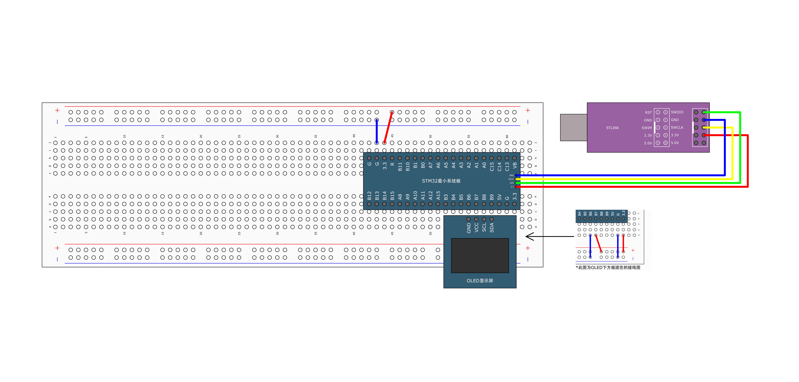

# 一、引言

你是否曾好奇电脑的时钟计时是如何实现的？又或者觉得网络上的天气时钟很炫酷？

本文将基于**实际项目经验**，手把手教你：

1. **掌握**STM32定时器**原理及配置**
2. **实现**简单的秒表计时demo，获取现成可用的**工程代码**

# 二、基本概念

## 2.1 定时器的定义

单片机的**定时器（Timer）是其内部的一个重要功能模块，主要用于计时、计数、生成精确的时间间隔或控制周期性操作**。其本质上是一个**计数器**，通过对时钟脉冲进行计数来实现计时功能。时钟源可以是单片机的主时钟（内部晶振）或外部引脚输入的信号。

## 2.2 定时器的时基单元

时基单元是定时器的核心结构，由三部分组成，即计数器，预分频器，自动重装载寄存器

计数器：用于对时钟源信号进行计数，可以是**递增计数**或**递减计数**。

预分频器：用于将高频时钟信号分频，降低计数频率，从而延长定时时间范围。例如，主频为16MHz的单片机，通过预分频器分频为16分频后，计数频率变为1MHz（每1μs计数一次）。

自动重装载寄存器：设定的计数目标值，当计数器达到设定值（溢出）时，会自动重置为初始值（重装载值），并触发中断或事件。例如：16位定时器的最大计数值为2^16=65535，若设置重装载值为50000，则每50000次计数触发一次中断。

<aside>
❓ 定时器如何通过计数来实现计时呢？

假设定时器的时钟源频率是72MHz，预分频器为72，自动重装载寄存器设定值是10000。分频之后的时钟频率是：

$$
\frac{72MHz}{72}=1MHz
$$

周期T，即每计1个数所需时间是

$$
T=\frac{1}{f}=\frac{1}{10^6}s
$$

即1秒就能计1000000个数。

因此，计数器从0计数到目标值10000所需时间是

$$
\frac{10000}{1000000}=0.01s
$$

即每0.01s产生一次中断。这样就可以实现0.01s为单位的计时。

> *对于72MHz的时钟源，可以实现最大59.65s的计时。*

$$
\frac{2^{16}}{72000000/65535}=59.65s
$$

</aside>

## 2.3 定时器级联功能

有的小伙伴可能会问，你这计时时长也太短了。即便是72,MHz的时钟源，也最多只能实现59秒的计时。如果想实现更长时间的计时，这就需要使用到定时器的级联功能，即将一个定时器的输出作为另一个计时器的输入。假设我们第一个计时器的计时时长为59秒，设定第二个计时器的自动重装载寄存器为2^16=65535，那么我们级联后的最大时长就为59*2^16=1074h。这就是指数爆炸的威力。

## **2.4 定时器的主要功能**

<aside>
✅ 定时器不仅具备基本的定时中断功能，而且还包含内外时钟源选择、输入捕获、输出比较、编码器接口、主从触发模式等多种功能

1. **定时模式**：
   - 用于生成精确的时间间隔。例如：
     - 定时1秒后触发某个操作（如LED闪烁）。
     - 周期性执行任务（如每10ms采集一次传感器数据）。
2. **计数模式**：
   - 对外部信号（如传感器脉冲、按键按下次数）进行计数。
3. **PWM输出**：
   - 通过调节占空比控制电机速度、LED亮度等。
   - 例如：使用定时器生成频率1kHz、占空比50%的方波。
4. **输入捕获**：
   - 测量外部信号的脉冲宽度或频率。
   - 例如：测量超声波传感器的回波时间。
5. **输出比较**：
   - 在特定计数值时触发输出引脚的电平变化，用于精确控制时序。

## 2.5 定时器的类型

定时器根据复杂度和应用场景分为了高级定时器、通用定时器、基本定时器三种类型


# 三、定时器配置

## 3.1 定时器结构

- 基本定时器

基本定时器结构最简单，仅由时基单元、触发控制器构成。来自内部时钟源（内部晶振）产生的方波信号经由TIMxCLK传入触发控制器，随后经由时基单元计数，当计数值达到重载寄存器设定值，触发中断/事件。当中断配置到TRGO，将直接触发DAC实现硬件中断，不必经过CPU处理，这样就可以节省CPU资源，尤其是在数模转换这种频繁使用的场景，可以减少中断造成的CPU执行卡顿。


- 通用定时器

通用定时器拥有基本定时器全部功能，并额外具有内外时钟源选择、输入捕获、输出比较、编码器接口、主从触发模式等功能。

通用定时器的内外时钟源除了可使用内部RCC的晶振时钟源，还可选择外接晶振，或者外部能够产生方波信号的设备作为时钟源；输入捕获可实现测量外部信号的脉冲宽度或频率的功能；输出比较常用于产生PWM，进行电机的控制；编码器接口则可直接使用硬件中断对电机速度进行测量。


- 高级定时器

高级定时器则拥有通用定时器全部功能，并额外具有重复计数器、死区生成、互补输出、刹车输入等功能


<aside>
✅ 定时器流程分为时钟源选择、时基单元计数、中断输出配置第三个阶段


## 3.2 定时器配置

**TIM配置步骤**：

1. 开启定时器时钟并配置时钟模式


1. 时基单元初始化及参数配置


1. 定时器中断开启

```c
// 使能或者失能指定的 TIM 中断
void TIM_ITConfig(TIM_TypeDef* TIMx, u16 TIM_IT, FunctionalStateNewState)
```

1. NVIC配置


1. 定时器中断使能开启

```c
/*设置优先级分组：先占优先级和从优先级*/
void NVIC_PriorityGroupConfig(u32 NVIC_PriorityGroup)
 
/*根据 NVIC_InitStruct 中指定的参数初始化外设 NVIC 寄存器*/
void NVIC_Init(NVIC_InitTypeDef* NVIC_InitStruct)

/*根据 NVIC_InitStruct 中指定的参数初始化外设 NVIC 寄存器*/
```

# 四、小试牛刀

## 4.1 定时器内部时钟实现秒表计时

**定时器定时中断程序**：下载程序后，OLED上显示数字“number”，每秒自动加一。该程序利用定时器内部时钟设定一秒定时，每隔一秒申请中断，在中断函数中执行“number++”操作，最后在OLED上显示结果。

<aside>
🛠 实验环境

- 硬件：`STM32F10C8T6开发板 + ST-LINK模块 + OLED显示屏`
- 软件：`Keil5`
- 依赖库：`STM32标准库`



代码实现（[工程代码GitHub链接点击我](https://github.com/Northfourta/STM32ForBeginner/tree/main/6-1%20%E5%AE%9A%E6%97%B6%E5%99%A8%E4%B8%AD%E6%96%AD%E5%AE%9E%E7%8E%B0%E5%AE%9A%E6%97%B6)）：

```c
/*
filename: main.c
*/
#include "stm32f10x.h"                  // Device header
#include "Delay.h"
#include "OLED.h"
#include "Timer.h"

uint16_t count;

int main(void)
{

	OLED_Init();
	Timer_Init();
	OLED_ShowString(1, 1, "Count:");
	
	while(1){
		
//		OLED_ShowString(1, 3, "HelloWorld!");
//		OLED_ShowNum(2, 1, 12345, 5);
//		OLED_ShowSignedNum(2, 7, -66, 2);
//		OLED_ShowHexNum(3, 1, 0xAA55, 4);
//		OLED_ShowBinNum(4, 1, 0xAA55, 16);
		
		OLED_ShowNum(1, 7, count, 5);
		OLED_ShowNum(2, 1, TIM_GetCounter(TIM2), 5);
	}
}

	/* TIM2定时中断函数*/
void TIM2_IRQHandler(void)
{
	if (TIM_GetITStatus(TIM2, TIM_IT_Update)==SET)
	{
		count ++;
		TIM_ClearITPendingBit(TIM2, TIM_IT_Update);
	}
}

------------------------------------------------------------------
/*
filename: Timer.h
*/
#ifndef __TIMER_H
#define __TIMER_H

void Timer_Init(void);

#endif
------------------------------------------------------------------
/*
filename: Timer.c
*/
#include "stm32f10x.h"                  // Device header

void Timer_Init(void)
{
	// 开启timer2的时钟
	RCC_APB1PeriphClockCmd(RCC_APB1Periph_TIM2, ENABLE);
	TIM_InternalClockConfig(TIM2); // TIM内部时钟模式
	
	/* 时基单元初始化*/
	TIM_TimeBaseInitTypeDef TimerInitStructure;
	TimerInitStructure.TIM_ClockDivision = TIM_CKD_DIV1; // 不分频
	TimerInitStructure.TIM_CounterMode = TIM_CounterMode_Up; // 向上计数
	TimerInitStructure.TIM_Period = 7200 - 1;
	TimerInitStructure.TIM_Prescaler = 10000 - 1;
	TimerInitStructure.TIM_RepetitionCounter = 0;
	TIM_TimeBaseInit(TIM2, &TimerInitStructure);
	
	/* 定时器中断控制*/
	TIM_ITConfig(TIM2, TIM_IT_Update, ENABLE); 
	
	/* NVIC配置*/
	NVIC_PriorityGroupConfig(NVIC_PriorityGroup_2);
	NVIC_InitTypeDef NVIC_InitSturcture;
	NVIC_InitSturcture.NVIC_IRQChannel = TIM2_IRQn;
	NVIC_InitSturcture.NVIC_IRQChannelCmd = ENABLE;
	NVIC_InitSturcture.NVIC_IRQChannelPreemptionPriority = 1;
	NVIC_InitSturcture.NVIC_IRQChannelSubPriority = 2;
	NVIC_Init(&NVIC_InitSturcture);
	
	/*TIM使能*/
	TIM_Cmd(TIM2, ENABLE);			//使能TIM2，定时器开始运行
}
```

## 4.2 定时器外部时钟实现光耦计数

**定时器中断外部时钟程序**：下载程序后，OLED上显示数字“number”及其值。传感器每被遮挡一次，number+1。该程序利用光耦作为外部时钟，光耦每遮挡1次，申请中断，在中断函数中执行“number++”操作，最后在OLED上显示结果。（[工程代码-GitHub链接点击我](https://github.com/Northfourta/STM32ForBeginner/tree/main/6-2%20定时器中断外部时钟)）

<aside>
🛠 实验环境

- 硬件：`STM32F10C8T6开发板 + ST-LINK模块 + OLED显示屏 + 红外传感器`
- 软件：`Keil5`
- 依赖库：`STM32标准库`


<aside>
❓ 外部时钟源通过GPIO14接口输入，程序无法实现
  依据参考手册，TIM2只可使用PA0、PA15端口
  

<aside>
❓ 出现TIM_Counter值乱跳现象

原因：传感器输入存在信号抖动，并非完美的方波信号

解决：配置外部时钟的滤波器，降低采样频率，可以一定程度滤掉数据抖动


<aside>
❓ TIM_PSC的影响? 当TIM_PSC由0更改为9时，时钟信号每变化10次，才会触发TIM_Counter变化一次

解释：STM32定时器的预分频器实际分频系数为 **PSC + 1**。定时器溢出中断发生在计数器值达到自动重装载值（ARR）时，所需的总脉冲数为：**总脉冲数 = (ARR + 1) × (PSC + 1)**
