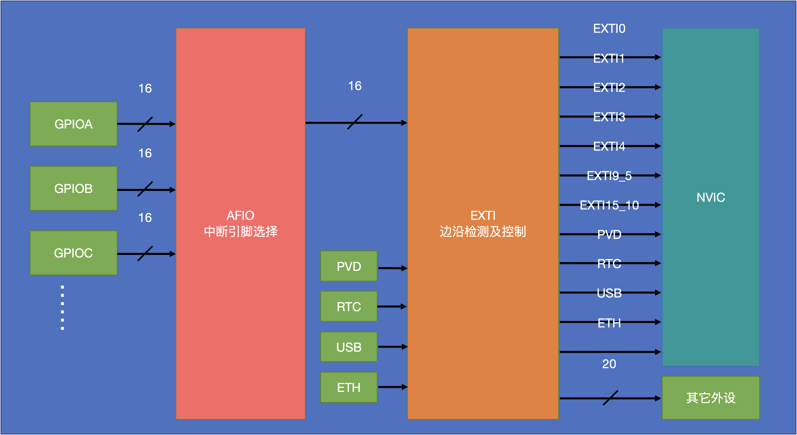

第一次接触单片机还是在大二那个暑假，初次使用的是Arduino平台，在它上面完成了电子小白-电灯大师-循迹小车的过程，算是初步入门了。但也仅此而已了，虽然后期尝试学习STM32，但都没有很好的坚持下来，平衡小车项目也就此搁置。

如今的我已经初入职场，成为打工牛马，过去五个月一直浑浑噩噩，迷茫。也正是此时，碰上公司裁员。回想自己过去五个月的经历，似乎没有什么收获成长。这份工作能够干多久，下一步又该怎么办？我不知道。不管怎样，只要在制造业继续从业，就免不了要和单片机接触。于是，我决定利用业余时间重拾STM32。相比于STM32在工业界的地位，Arduino更像是给小白提供的一种玩具。本篇博文将会记录我关于STM32的所有学习相关笔记及感想！

<!-- more -->　

# 1. 初识STM32

STM32是ST公司基于ARM Cortex-M内核开发的32位微控制器，常应用在嵌入式领域，如智能车、无人机、机器人、无线通信、物联网、工业控制、娱乐电子产品等。STM32系列包括多个子系列，每个子系列针对特定的应用场景和需求进行了优化。


## 1.1 STM32F103C8T6

STM32F103C8T6属于STM32F1主流系列，是基于Cortex-M3内核的一款STM32经典处理器，也是大学生用于各类机器人及科技竞赛最常见的MCU。其采用LQFP48封装，主频72MHz，RAM大小20K，ROM大小64K，供电电压为2.0～3.6V。


STM32功能强大、性能优异、片上资源丰富、具有**丰富的外设**：包括ADC、DAC、定时器、串口、I2C、SPI、USB、以太网、CAN等，支持多种通信和控制接口。


STM产品型号字符均有意义，拿STM32F103C8T6，其每个字符代表如下意义


## 1.2 系统结构


## 1.3 基本外设

### 1.3.1 GPIO

GPIO（General Purpose Input Output），中文称为通用输入输出口，CPU可配置利用GPIO实现高低电平信号的输出和读取。STM32的GPIO可配置成八种输入输出模式。输出模式下可控制端口输出高低电平，用以驱动LED、控制蜂鸣器、模拟通信协议输出时序等，输入模式下可读取端口的高低电平或电压，用于读取按键输入、外接模块电平信号输入、ADC电压采集、模拟通信协议接收数据等。


GPIO是由三个寄存器以及“TTL肖特基触发器、二极管、P-MOS管和N-MOS管”组成[1]。输入输出部分是分开的，当GPIO引脚配置为输出模式时，输入电路则不工作


每个GPIO口都有一组引脚连接，并且这组引脚，如PA-PG(引脚编号)连接到GPIOA中，其中有一个引脚的作用是输出，说的直接一点GPIO口是一个可编程的引脚，我们通过对GPIO口里的寄存器进行配置，让CPU对特定的引脚输出高电平。其基本工作流程为：CPU通过APB2总线控制寄存器，驱动器依据寄存器中不同位的内容（0/1）输出高低电平，实现对GPIO的控制。因此，STM32中代码控制GPIO步骤应包含以下几步：

1. 开启GPIO对应的总线时钟（这里是APB2）；
2. 初始化GPIO；
3. 控制GPIO；

代码示例：

```c
// 开启中断相应的时钟
RCC_APB2PeriphClockCmd(RCC_APB2Periph_GPIOB, ENABLE); // GPIO时钟
// 配置GPIO
GPIO_InitTypeDef GPIOInitSturcture; // 定义GPIO结构体
GPIOInitSturcture.GPIO_Mode = GPIO_Mode_Out_PP; //推挽输出
GPIOInitSturcture.GPIO_Pin = GPIO_Pin_14; // 使用的GPIO端口
GPIOInitSturcture.GPIO_Speed = GPIO_Speed_50MHz; // GPIO通讯频率
GPIO_Init(GPIOB, &GPIOInitSturcture); // GPIO初始化
//控制GPIO
GPIO_SetBits(GPIOB, GPIO_Pin_12);					// PB12 输出高电平
GPIO_ResetBits(GPIOE, GPIO_Pin_12);					// PB12 输出低电平
```


### 1.3.2 中断

#### 什么是中断

在主程序运行过程中，出现了特定的中断触发条件（中断源），使得CPU暂停当前正在运行的程序，转而去处理中断程序，处理完成后又返回原来被暂停的位置继续运行


中断具有优先级，当有多个中断源同时申请中断时，CPU会根据中断源的轻重缓急进行裁决，优先响应更加紧急的中断源

中断嵌套：当一个中断程序正在运行时，又有新的更高优先级的中断源申请中断，CPU再次暂停当前中断程序，转而去处理新的中断程序，处理完成后依次进行返回

#### 为什么需要中断，优势是什么？

**中断机制存在的原因**

+ 提高系统效率（节省CPU资源）
  在计算机系统中，如果没有中断机制，CPU就需要不断地轮询设备状态。例如，CPU要知道打印机是否完成打印任务，如果没有中断，它只能持续地检查打印机的状态寄存器。这会浪费大量的CPU时间，因为在打印机未完成任务的大部分时间里，CPU做的这种轮询是无意义的。而有了中断机制，打印机在完成任务时可以主动向CPU发送中断信号，CPU就可以在这段时间去处理其他更有意义的任务，如运行其他程序或者处理其他设备的请求。
+ 实现多任务处理（中断优先级）
  现代操作系统支持多任务运行。当多个任务并发执行时，中断机制可以有效地协调各个任务之间的资源分配和执行顺序。比如，当一个任务正在占用CPU执行时，如果有更高优先级的任务需要处理（如实时性很强的网络数据接收任务），可以通过中断机制暂停当前任务，让CPU转而处理更高优先级的任务。这有助于保证系统对各种任务的响应及时性，特别是对于那些对时间敏感的任务，如多媒体播放中的音频视频同步等任务。
+ 设备交互需求（避免信息丢失）
  计算机系统中有各种各样的外部设备，如鼠标、键盘、硬盘等。这些设备的工作速度与CPU的速度相比非常慢。如果没有中断机制，设备与CPU之间的数据传输就会非常困难。以键盘为例，当用户按下一个键时，键盘需要向CPU发送相应的字符编码。通过中断机制，键盘可以在按键按下时及时通知CPU来读取这个编码，而不需要CPU一直等待键盘输入。
+ 异常处理
  在程序执行过程中，可能会出现各种异常情况，如除数为零、访问非法内存地址等。中断机制可以将这些异常当作一种特殊的中断（称为异常中断）来处理。当发生这些异常时，系统可以通过中断机制停止当前程序的错误执行，避免系统崩溃，并进行相应的错误处理，如显示错误信息、终止程序或者尝试恢复程序的执行环境等。

**中断的优势**

+ 实时响应性
  对于一些实时性要求很高的设备或任务，中断机制提供了很好的解决方案。例如在工业控制领域，传感器检测到危险情况（如温度过高、压力过大等）时，能够立即通过中断通知控制系统采取措施。这种实时响应能力可以避免潜在的危险和损失，因为系统不需要等待CPU的轮询周期才能得到传感器的状态信息。
+ 资源利用率提高
  由于中断机制避免了CPU的大量无意义轮询，使得CPU能够更多地用于实际的数据处理和任务执行。这提高了整个系统的资源利用率，无论是CPU资源还是其他硬件资源。例如，在一个服务器系统中，通过中断机制可以让CPU更好地处理来自多个客户端的请求，而不会被一些慢速设备（如硬盘读写）的状态查询所浪费时间。
+ 增强系统灵活性
  中断机制允许不同设备和任务按照各自的需求与CPU进行交互。操作系统可以根据设备的优先级、任务的性质等因素灵活地配置中断相关的参数，如中断向量、中断优先级等。这种灵活性使得系统能够适应不同的应用场景，无论是桌面计算机系统、移动设备还是大型服务器系统。
+ 支持异步操作
  许多设备的操作是异步的，例如网络数据的接收和发送。中断机制能够很好地处理这种异步操作。当网络接口接收到新的数据时，它可以通过中断通知CPU来处理数据，而不需要CPU一直等待数据的到来。同样，在发送数据时，CPU可以将数据交给网络接口设备后继续执行其他任务，当数据发送完成时由设备通过中断通知CPU。

#### 中断使用场景

单片机中断有多种使用场景，常见的包括以下几种：

+ 定时器中断：
  精确延时：比如在智能家电中，需要定时开启或关闭某个功能，如空调定时开关机，可通过定时器中断实现精确的时间控制。
  周期性任务：在工业自动化生产线上，某些设备需要周期性地进行数据采集或状态检测，定时器中断可确保这些任务按固定时间间隔执行。
+ 外部中断：
  按键检测：在电子设备中，如手机、遥控器等，按下按键时会产生外部中断，单片机响应中断后执行相应的按键处理程序，实现对应功能，如调整音量、切换频道等。
  传感器信号检测：用于检测温度、湿度、压力等传感器的输出信号。当传感器状态变化达到设定阈值时，触发外部中断，单片机进行数据读取和处理，例如在智能家居系统中，根据温度传感器的信号自动控制空调或暖气的运行。
+ 串口中断：
  数据通信：在需要与外部设备进行数据交互的场景中广泛应用，如计算机与单片机之间的数据传输、单片机与其他嵌入式设备的通信等。当串口接收到数据时，触发中断，单片机及时处理接收的数据，可用于实现实时监控、远程控制等功能，比如在远程监控系统中，单片机通过串口中断接收监控数据并进行处理和传输。
+ 软件中断：
  系统异常处理：当系统出现故障或异常情况时，如程序运行出错、数据溢出等，可通过软件中断触发相应的异常处理程序，进行错误诊断、记录和恢复操作，以保证系统的稳定性和可靠性。
  状态切换：在一些复杂的控制系统中，根据不同的条件和事件需要切换系统的工作状态，软件中断可用于实现这种状态的快速切换，例如在智能交通信号灯控制系统中，根据不同的时间段和交通流量情况，通过软件中断切换信号灯的显示模式。

#### EXTI（Extern Interrupt）外部中断

EXTI可以监测指定GPIO口的电平信号，当其指定的GPIO口产生电平变化时，EXTI将立即向NVIC发出中断申请，经过NVIC裁决后即可中断CPU主程序，使CPU执行EXTI对应的中断程序

支持的触发方式：上升沿/下降沿/双边沿/软件触发

支持的GPIO口：所有GPIO口，但相同的Pin不能同时触发中断

通道数：16个GPIO_Pin，外加PVD输出、RTC闹钟、USB唤醒、以太网唤醒

触发响应方式：中断响应/事件响应

#### 外部中断的结构

1. **整体架构**：外部中断的整体结构较为复杂，从左到右依次为 GPIO 口外设、AFIO 中断引脚选择电路模块、EXTI 边缘检测及控制电路，最后分为触发中断和触发事件两路输出。GPIO 口外设有多个，每个外设包含 16 个硬件引脚，这些引脚的信号首先进入 AFIO 选择电路
2. **AFIO 选择电路**：AFIO 主要用于引脚复用功能的选择和定义，在外部中断中，它起到中断引脚选择的关键作用。由于 GPIO 口硬件引脚数量众多，而 EXTI 模块只有 16 个 GPIO 通道，AFIO 通过数据选择器，从多个 GPIO 口的 16 个硬件引脚中选择一个连接到 EXTI 通道，这就解释了为何相同编号的引脚不能同时触发中断
3. **EXTI 内部电路**：经过 AFIO 选择后的 16 个通道信号与其他 4 个特殊功能信号（PVD 输出、RTC 闹钟、USB 唤醒、以太网唤醒）共同组成 EXTI 的 20 个输入信号，进入 EXTI 边缘检测及控制电路。该电路可选择上升沿、下降沿或双边沿触发，触发信号经过或门后兵分两路。一路用于触发中断，会先设置挂起寄存器，通过与中断屏蔽寄存器共同进入与门，决定是否向 NVIC 中断控制器发送中断信号；另一路用于触发事件，经过事件屏蔽寄存器控制后，通过脉冲发生器触发其他外设操作




**代码实现**：STM32中代码实现外部中断步骤应包含以下几步：

1. 开启GPIO对应的总线时钟（这里是APB2）；
2. 初始化GPIO；
3. 开启AFIO时钟；
4. 配置EXTI及NVIC；
5. 向中断函数中添加中断执行程序；

代码示例：

```c
// 中断配置
void CounterSensor_Init(void)
{
	// 开启中断相应的时钟
	RCC_APB2PeriphClockCmd(RCC_APB2Periph_GPIOB, ENABLE); // GPIO时钟
	RCC_APB2PeriphClockCmd(RCC_APB2Periph_AFIO, ENABLE); // AFIO时钟
	// 配置GPIO
	GPIO_InitTypeDef GPIOInitSturcture; // 定义GPIO结构体
	GPIOInitSturcture.GPIO_Mode = GPIO_Mode_IPU; //上拉输入
	GPIOInitSturcture.GPIO_Pin = GPIO_Pin_14; // 使用的GPIO端口
	GPIOInitSturcture.GPIO_Speed = GPIO_Speed_50MHz; // GPIO通讯频率
	GPIO_Init(GPIOB, &GPIOInitSturcture); // GPIO初始化
	// 配置AFIO，中断引脚选择
	GPIO_EXTILineConfig(GPIO_PortSourceGPIOB, GPIO_PinSource14);
	// 配置EXTI
	EXTI_InitTypeDef EXTIInitSturcture;
	EXTIInitSturcture.EXTI_Line = EXTI_Line14;
	EXTIInitSturcture.EXTI_LineCmd = ENABLE;
	EXTIInitSturcture.EXTI_Mode = EXTI_Mode_Interrupt;
	EXTIInitSturcture.EXTI_Trigger = EXTI_Trigger_Rising;
	EXTI_Init(&EXTIInitSturcture);
	
	NVIC_PriorityGroupConfig(NVIC_PriorityGroup_2);
	NVIC_InitTypeDef NVICInitSturcture;
	NVICInitSturcture.NVIC_IRQChannel = EXTI15_10_IRQn;
	NVICInitSturcture.NVIC_IRQChannelCmd = ENABLE;
	NVICInitSturcture.NVIC_IRQChannelPreemptionPriority = 1;
	NVICInitSturcture.NVIC_IRQChannelSubPriority = 1;
	NVIC_Init(&NVICInitSturcture);
	
}
// 中断函数
void EXTI15_10_IRQHandler(void)
{
	if (EXTI_GetITStatus(EXTI_Line14) == SET)
	{
		
		EXTI_ClearITPendingBit(EXTI_Line14); //清除中断标志位
	}
}
```

> **中断的注意事项**
>
> + 适用于对通讯频率及实时性有要求的场景，如电机测速、按键识别；
> + 避免长/复杂代码，若中断中的代码复杂度较高，执行费时，则可能会导致主程序的阻塞；
> + 避免和主函数操作同一硬件

### 1.3.3 定时器


# Reference

1. [详细介绍GPIO、I2C、SPI通讯原理以及物理层原理](https://blog.csdn.net/bjbz_cxy/article/details/119925257)
2. [对中断的理解](https://zhuanlan.zhihu.com/p/145096244)

