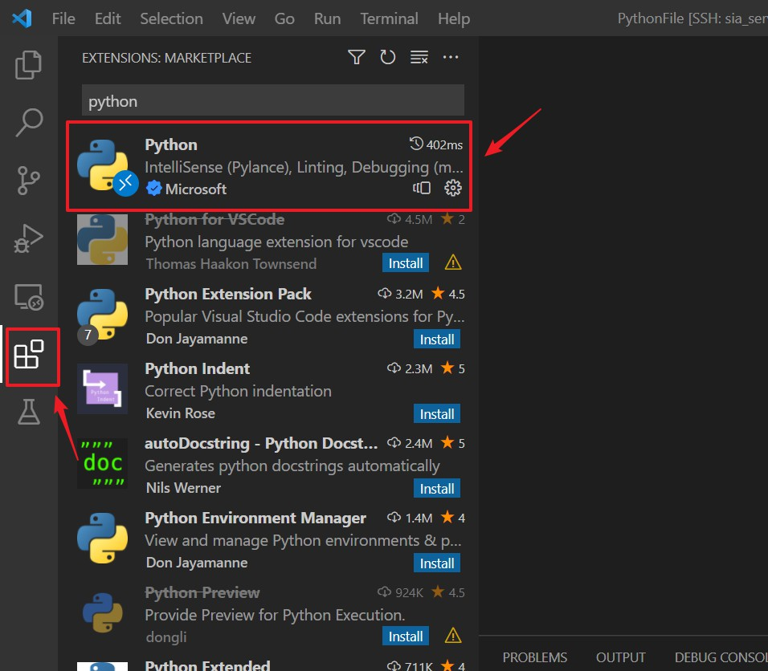
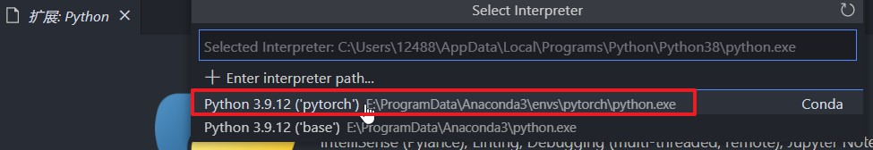

宇宙第一IDE，当属 VSCode。作为一名高级炼丹师，怎么能不会远程连接服务器进行开发呢。接下来就讲述如何使用 VSCode 远程连接服务器进行炼丹操作。

<!-- more -->

## 一、安装

### step 1：安装 Anaconda

前往[Anaconda](https://www.anaconda.com/products/individual)官网，下载对应版本Anaconda安装包。

安装包下载完成后，进行安装，记得自己Anaconda的安装路径。

### step2：安装 VSCode

前往[Visual studio code](https://code.visualstudio.com/)页面进行下载安装。

### step3：在VSCode中安装插件

【在 VSCode 插件商店中搜索 Python、Jupyter、Remote-SSH，选择插件并点击 install 安装程序】

## 二、远程连接服务器

### step1：Remote-SSH 连接配置

【打开SSH TARGETS连接服务器】输入ssh 用户名@+服务器IP

【选 C:\用户名\\.ssh\config 进行配置】

【修改 config 配置文件】Host后面为你的服务器备注（随意命名），HostName 为连接的服务器 ip 地址，User 为服务器用户名

### step2：SSH  插件设置

【勾选 Remote-SSH 设置中的 show login terminal】以便我们可以在 Terminal 中观察到我们的Connect Information

### step3：连接服务器

【连接刚刚建好的 SSH Target】

【选择服务器对应的系统平台】

【输入 服务器密码 进行登陆】

左下角 蓝色 为连接成功，通过 Terminal 进行 conda 操作

## 三、配制 jupyter 环境

### step1：在 VSCode 中选择 Python 环境

【选择自己配置好的 conda 环境】这里选择事先安装好的虚拟环境

### step2：文件操作

【文件 - 打开文件夹】即可对服务器下文件进行操作

### step3：代码运行测试，成功！

