工作需要，对之前使用的cellpose通用细胞分割算法安装及使用进行整理。

<!-- more -->

## 1. 安装 Anaconda

前往[Anaconda](https://www.anaconda.com/products/individual)官网，下载对应版本Anaconda安装包。

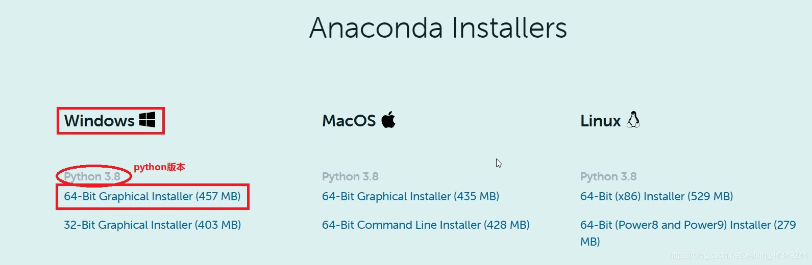

安装包下载完成后，进行安装，记得自己Anaconda的安装路径。

## 2. 拉取Cellpose Github源码

进入[MouseLand/cellpose](https://github.com/MouseLand/cellpose)网站，下载源码至本地，并解压

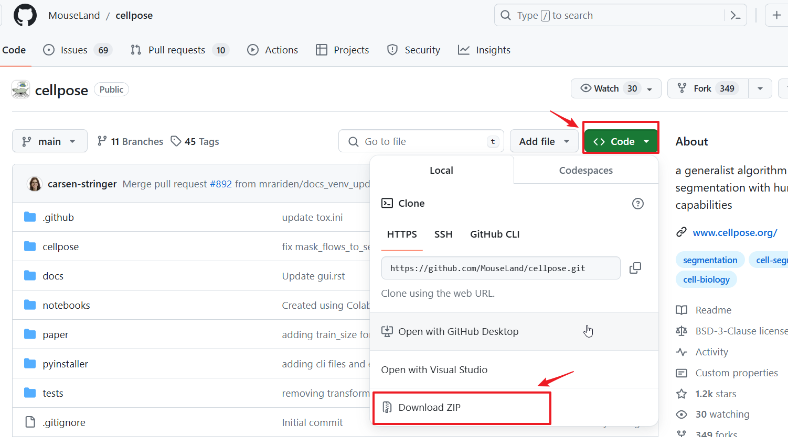

## 3. 配置 Cellpose 所需环境

进入anaconda prompt，终端模式下，进入前面下载的github文件路径，我的路径为`E:\cellpose-main`

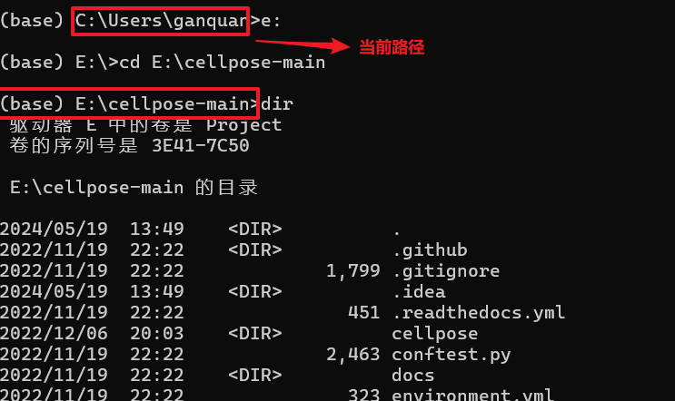

`environment.yml`为环境的配置文件，将依据该环境文件配置conda环境

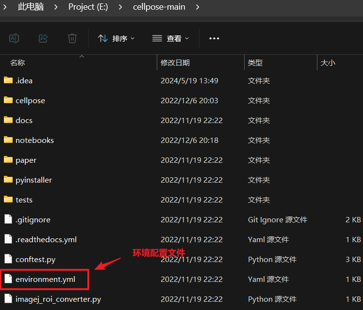

终端中运行如下命令，将在本地电脑上部署环境

```BASH
$  conda env create -f myenv.yaml
```

等待下载完成，激活新环境

```bash
$  conda env list #查看当前电脑上已存在的环境
```

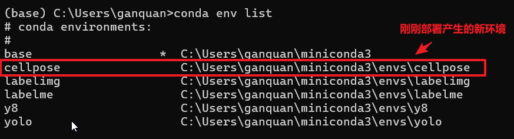

激活环境，并查看当前环境下的安装库

```bash
$  conda activate cellpose #激活cellpose环境
$  conda list
```

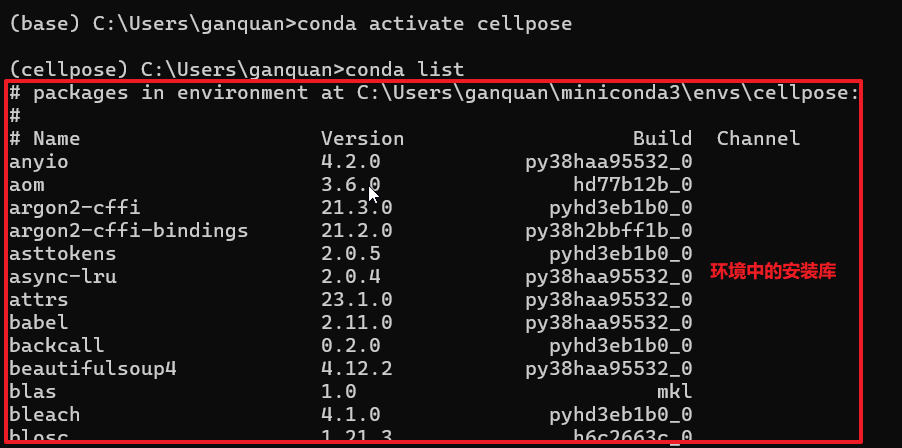

## 4. 运行程序，分割图像

安装并运行 jupyter notebook

```bash
$  conda install jupyter # 安装 jupyter notebook
$  jupyter notebook # 运行jupyter notebook
```

jupyter notebook 界面如下

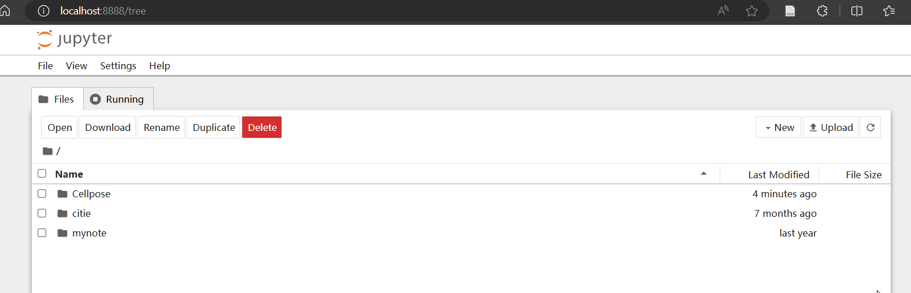

进入并运行`Cellpose\notebooks\run_cellpose_gq.ipynb`文件

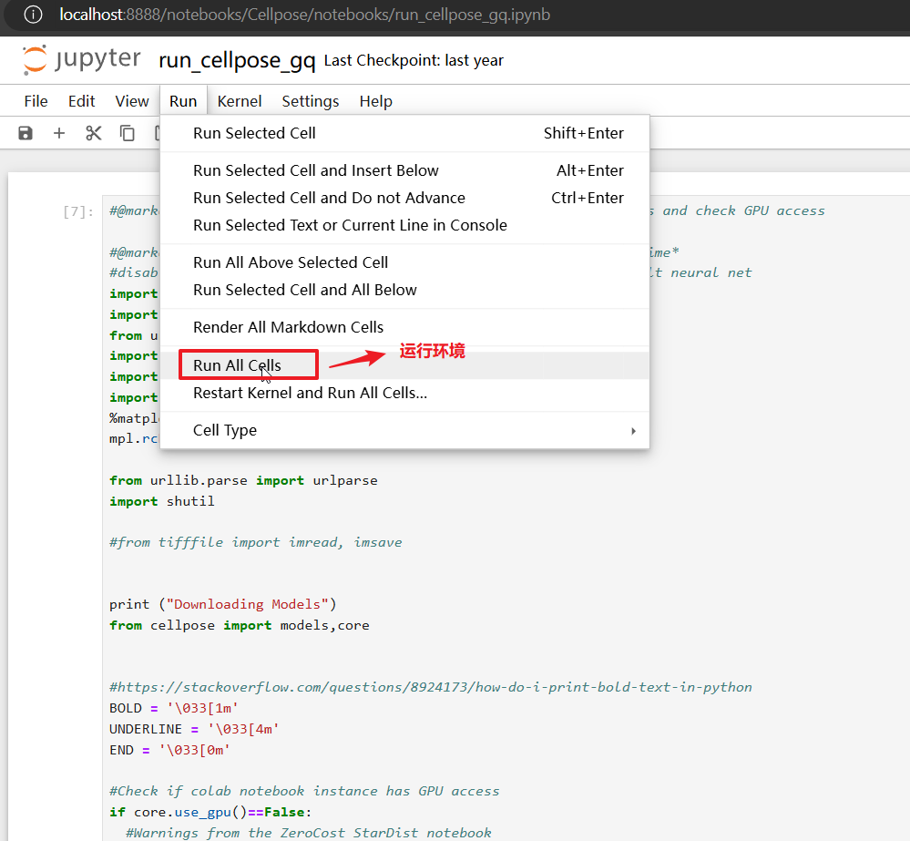

 若报以下错误，按以下解决方法进行解决

> 错误1：

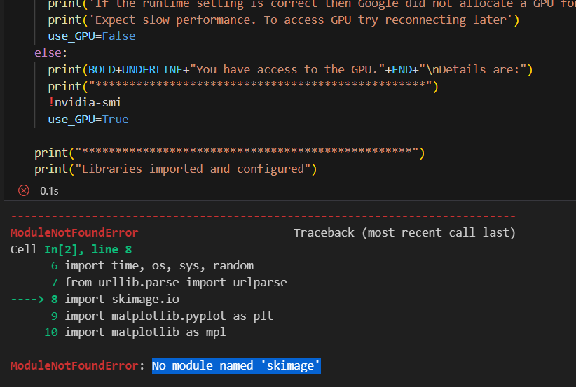

> 解决错误1：运行`conda install scikit-image`命令

> 错误2：

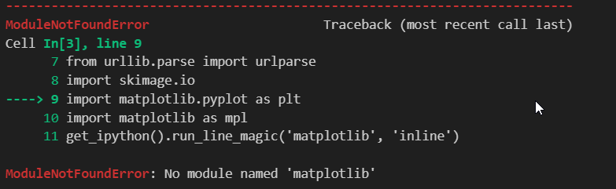

> 解决错误2：运行`conda install matplotlib`命令

待处理图片放在对应文件夹中

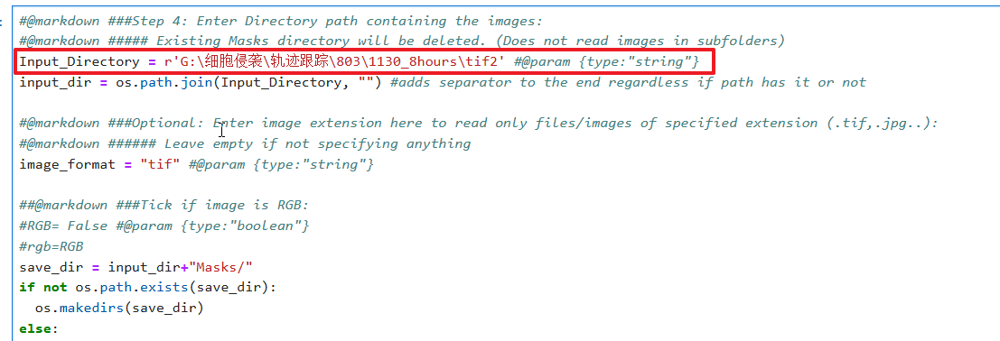

运行程序，开始分割图片

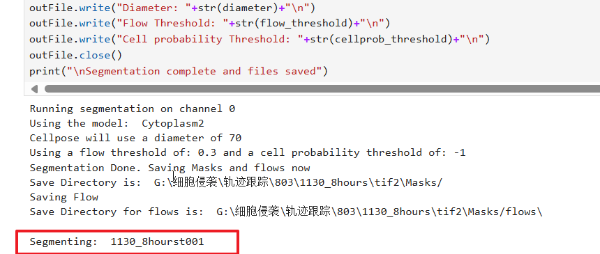

分割效果

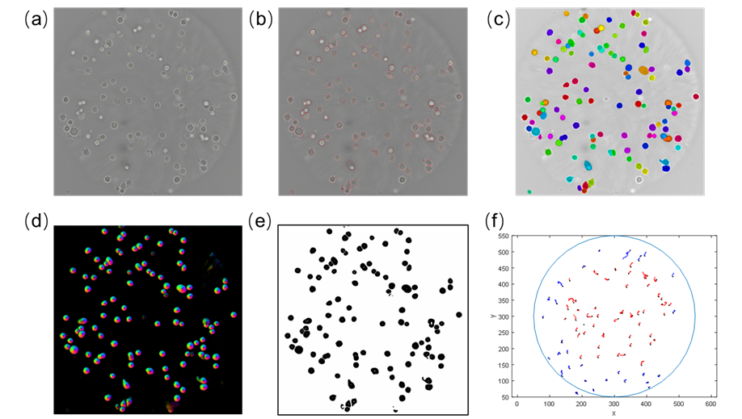
