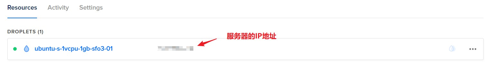

想我大清苦墙久矣！小生不才，无绝其本根之法，仅以此博客尽绵薄之力，盼科学上网全民普及早日实现。古人曰：“授人以鱼不如授人以渔”；我们伟大的教员也曾说：“自己动手丰衣足食”。为秉先人之诫，于此授解决之道；教大家如何从零搭建一台属于自己的梯子，让你科学上网不必求人。（此篇博客并不涉及基本原理的讲解，只负责基本实现，对原理有兴趣的同学可自行探究。）

<!-- more -->

## 一、准备工作

### 1. v2rayN客户端下载（windows）

下载方式一：GitHub

【v2rayN.exe Release】：[v2rayN Download url](https://github.com/v2ray/v2ray-core/releases)

解压【【点击 v2rayN.exe 启动】】


### 2. 购买vps服务器

推荐购买国外的vps服务器，这里博主使用GitHub学生礼包购买的digital ocean的vps服务器，$5/month

【1. 系统镜像选择Ubuntu即可】


【2. vps选择最低配即可，每月5刀】


【3. 服务器地址选择根据个人情况，这里博主选择的是洛杉矶】


【4. 配置选择完成后，便可以创建服务器】



## 二、连接服务器

连接服务器有多种途径，可以通过xshell进行远程连接，博主这里选择通过digital ocean提供的接口进行网页连接


【连接成功！！！】


## 三、搭建梯子

由于刚购置Linux没有进行配置，所以需要大家先安装crul进行配置，复制命令粘贴按确认即可

【ubuntu/debian 系统安装 Curl 方法:】

```c
apt-get update -y && apt-get install curl -y
```

【centos 系统安装 Curl 方法:】

```c
yum update -y && yum install curl -y
```

下载完成后运行如下命令：

```c
bash <(curl -s -L https://git.io/v2rayinstall.sh)
```

按照步骤安装即可（如果不清楚都选择**默认**），得到如下界面则说明安装成功


输入【v2ray url】可以得到一串vmess链接，将其复制到客户端即可


## 四、v2ray提速

安装bbr


## 五、搭建成功效果

ok，成功登陆Google and YouTube ！！！


