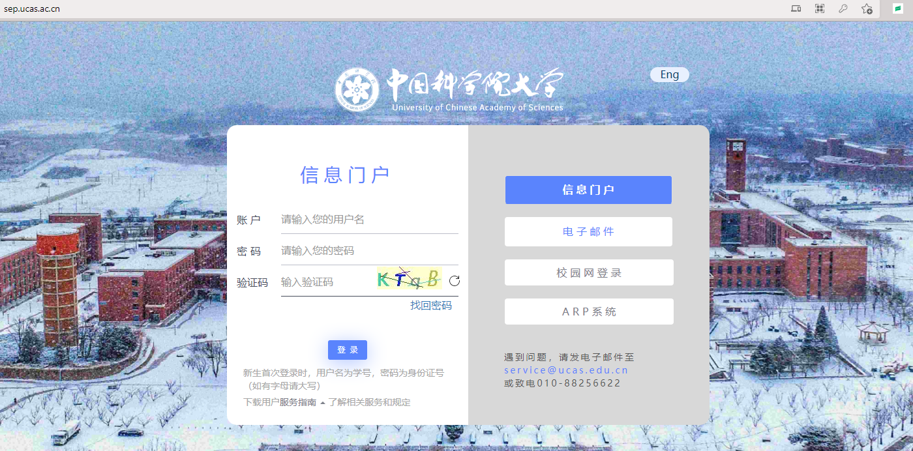
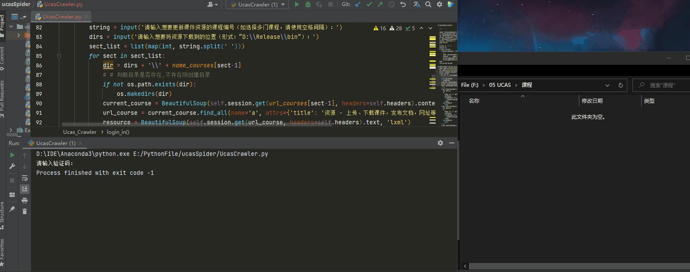

由于[UCAS](http://sep.ucas.ac.cn/)的课程网站无法进行批量下载课件（太反人类了），本人写了一个爬虫小程序，只需手动输入用户名、密码、验证码，即可实现课件的自动下载，解放双手。

<!-- more -->

## 1. 依赖库

+ requests
+ BeautifulSoup4
+ Image
+ os

## 2. 基本思路

使用requests库请求得到网页内容，BeautifulSoup 解析网页内容。验证码原本打算采用tesseract库进行OCR识别，但无奈识别效果不佳（有空再研究研究），最终选择人工输入验证码。



## 3. 演示效果



## 4. 代码展示

```python
'''
project： 基于Python的UCAS课程网站课件下载程序
author: Northfourta
dependent libraries:
    1. requests;
    2. BeautifulSoup4;
    3. Image;
    4. os
date: 2022/01/22
'''

import requests
from bs4 import BeautifulSoup
from PIL import Image
import os

class Ucas_Crawler:
    '''
    基于Python的UCAS课程网站课件下载程序
    '''
    def __init__(self, certCode_url, post_url, logined_url):
        self.certCode_url = certCode_url
        self.post_url = post_url
        self.logined_url = logined_url
        self.session = requests.Session() # 创建一个session会话
        self.headers = {
            'User-Agent': 'Mozilla/5.0 (Windows NT 10.0; Win64; x64) AppleWebKit/537.36(KHTML, like Gecko) Chrome/97.0.4692.71 Safari/537.36'
        }

    def get_certCode(self):
        '''
        得到验证码
        '''
        # 获得验证码图片
        codePic = self.session.get(self.certCode_url, headers=self.headers)
        # 将验证码图片存到本地
        with open('codePic.jpg', 'wb') as f:
            f.write(codePic.content)
            f.close()
        # 读取图片
        img = Image.open('codePic.jpg')
        img.show()
        certCode = input('请输入验证码：')
        return certCode

    def login_in(self, certCode):
        '''
        登陆网站
        '''
        name = input('请输入用户名：')
        pwd = input('请输入密码：')
        post_data = {   # 提交表单
            'userName': name,
            'pwd': pwd,
            'certCode': certCode,
            'sb': 'sb'
        }
        self.session.post(url=self.post_url, data=post_data, headers=self.headers) # 提交表单，模拟登陆
        login_page = self.session.get(url=self.logined_url, headers=self.headers)  # 获取登陆后页面信息
        soup_login = BeautifulSoup(login_page.text, 'html.parser')
        if login_page.status_code == 200:
            print('sep登陆成功！')
            # 解析获取课程网站所在页面网址
            portal_url = 'http://sep.ucas.ac.cn' + soup_login.find_all(name='a', attrs={'title': '课程网站'})[0]['href']
        return portal_url

    def Course_Info(self, portal_url):
        '''
        获取选课信息
        '''
        response = self.session.get(portal_url, headers=self.headers)
        url = BeautifulSoup(response.content, 'html.parser').find_all(name = 'h4')[0].a['href']
        soup = BeautifulSoup(self.session.get(url=url, headers=self.headers).content, 'html.parser')
        url_course = soup.find_all(name='a', attrs={'title': '我的课程 - 查看或加入站点'})[0]['href']
        re = BeautifulSoup(self.session.get(url_course, headers=self.headers).content, 'html.parser')
        list_course = re.find_all(name='tr')
        print('你当前已选课程如下：\n -----------------------------------------------')
        i = 0
        url_course = []  # 对应课程的链接网址
        name_course = []
        for course in list_course:
            if len(course.find_all(name='a', attrs={'target': '_top'})) > 0:
                i += 1
                content = course.find_all(name='a', attrs={'target': '_top'})[0]
                print(str(i) + '. ' + content['title'].split(' ')[-1])
                name_course.append(content['title'].split(' ')[-1])
                url_course.append(content['href'])
        print('-----------------------------------------------')
        return url_course, name_course

    def download_file(self, url_courses, name_courses):
        string = input('请输入想要更新课件资源的课程编号（如选择多门课程，请使用空格间隔）：')
        dirs = input('请输入想要将资源下载到的位置（形式：”D:\\Release\\bin“）：')
        sect_list = list(map(int, string.split(' ')))
        for sect in sect_list:
            dir = dirs + '\\' + name_courses[sect-1]
            # 判断目录是否存在,不存在则创建目录
            if not os.path.exists(dir):
                os.makedirs(dir)
            current_course = BeautifulSoup(self.session.get(url_courses[sect-1], headers=self.headers).content, 'html.parser')
            url_course = current_course.find_all(name='a', attrs={'title': '资源 - 上传、下载课件，发布文档，网址等信息'})[0]['href']
            resource = BeautifulSoup(self.session.get(url_course, headers=self.headers).text, 'lxml')
            # 下载所有的ppt
            for ppt in resource.find_all(name='a', attrs={'title': 'PowerPoint ', 'target': '_self'}):
                link = ppt['href']
                try:
                    filename = dir + '\\' + ppt.find(name='span', attrs={'class': 'hidden-sm hidden-xs'}).string
                    print(filename)
                    with open(filename, 'wb') as f:
                        f.write(self.session.get(link, headers=self.headers).content)
                    f.close()
                except AttributeError:
                    continue
            for ppt in resource.find_all(name='a', attrs={'title': 'Power Point', 'target': '_self'}):
                link = ppt['href']
                try:
                    filename = dir + '\\' + ppt.find(name='span', attrs={'class': 'hidden-sm hidden-xs'}).string
                    print(filename)
                    with open(filename, 'wb') as f:
                        f.write(self.session.get(link, headers=self.headers).content)
                    f.close()
                except AttributeError:
                    continue
            # 下载所有pdf
            for pdf in resource.find_all(name='a', attrs={'title': 'PDF', 'target': '_blank'}):
                link = pdf['href']
                try:
                    filename = dir + '\\' + pdf.find(name='span', attrs={'class': 'hidden-sm hidden-xs'}).string
                    print(filename)
                    with open(filename, 'wb') as f:
                        f.write(self.session.get(link, headers=self.headers).content)
                    f.close()
                except AttributeError:
                    continue
            # 下载所有word
            for word in resource.find_all(name='a', attrs={'title': 'Word ', 'target': '_self'}):
                link = word['href']
                try:
                    filename = dir + '\\' + word.find(name='span', attrs={'class': 'hidden-sm hidden-xs'}).string
                    print(filename)
                    with open(filename, 'wb') as f:
                        f.write(self.session.get(link, headers=self.headers).content)
                    f.close()
                except AttributeError:
                    continue
            # 下载其他资源
            for rar in resource.find_all(name='a', attrs={'title': '未知类型', 'target': '_self'}):
                link = rar['href']
                try:
                    filename = dir + '\\' + rar.find(name='span', attrs={'class': 'hidden-sm hidden-xs'}).string
                    print(filename)
                    with open(filename, 'wb') as f:
                        f.write(self.session.get(link, headers=self.headers).content)
                    f.close()
                except AttributeError:
                    continue

    def main(self):
        certCode = self.get_certCode()
        portal_url = self.login_in(certCode)
        url_course, name_course = self.Course_Info(portal_url)
        self.download_file(url_course, name_course)

if __name__ == '__main__':
    certCode_url = 'http://sep.ucas.ac.cn/changePic' # 验证码图片的地址
    post_url = 'http://sep.ucas.ac.cn/slogin'        # 用户名与密码的请求地址
    logined_url = 'https://sep.ucas.ac.cn/appStore'  # 登录后显示页面的地址
    crawler = Ucas_Crawler(certCode_url, post_url, logined_url)
    crawler.main()
```

> 源码地址：**Github: **[UCASCourserHelper](https://github.com/Northfourta/UCASCourserHelper)


