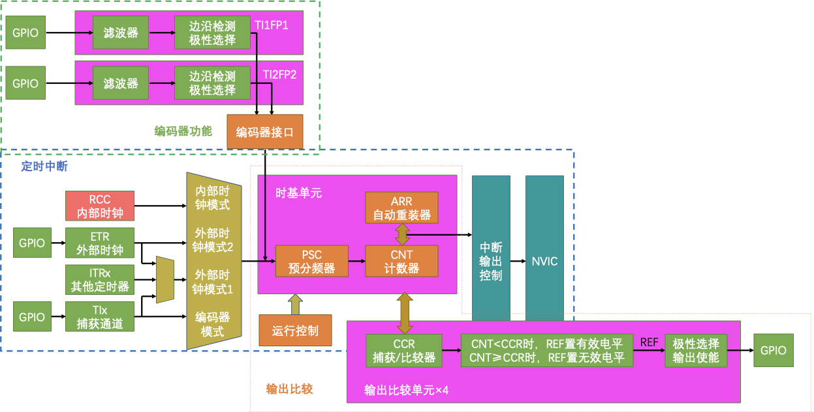

## 一、前言

定时器具备基本的定时中断功能，还包含内外时钟源选择、输入捕获、输出比较、编码器接口、主从触发模式等多种功能。输出比较功能可用作PWM信号的输出，编码器接口可用于电机速度及位置的获取。


现有场景需同时对两个编码器直流减速电机速度进行闭环控制。若使用tim实现，则最多需要四个定时器，其中两个定时器输出比较功能用作输出两路pwm，另外两个定时器编码器接口则进行编码器测速。

按照规格书，STM32F103C8T6有1个高级定时器，3个通用定时器。


在此工况下，当前的STM32F103C8T63个通用定时器资源显然不够。那么该工况所需的最少定时器资源到底是多少呢？回答这个问题之前，需要思考以下几个问题

1. 定时器的各功能之间（编码器、定时中断、输出比较）的使用是否互斥
2. 各功能之间的参数是否冲突，之间存在什么关系
3. 定时器多功能如何同时实现

## 二、编码器、定时中断、输出比较功能关系

定时器三种功能（编码器功能、定时中断、输出比较）的基本结构图见下图



由结构图可明显看到三种功能基本结构都包括时基单元，不同之处在于时基单元的输入与输出

- 编码器功能下，时基单元的输入信号是与编码器接口连接的GPIO输入信号。此时，编码器接口工作时不会使用72MHz内部时钟和时基单元初始化时设置的计数方向，此时计数时钟和计数方向均处于编码器接口托管的状态，计数器的自增和自减受编码器控制。
- 定时中断功能下，时基单元输入来自内部时钟源（内部晶振）产生的方波信号或者外部可作为时钟源设备产生方波信号。
- 输出比较功能下，时基单元输入与定时中断功能相同，既可来自于内部时钟源，也可来自于外部时钟源

由此可见，编码器功能下，时基单元输入受编码器接口托管，其信号来源会与定时中断及输出比较功能信号来源相冲突。因此，一个定时器不可同时开启编码器功能与定时中断及输出比较功能，而定时中断与输出比较功能可同时开启

就参数配置来说，当定时中断与输出比较功能同时开启时，其共用一套时基单元参数。此时定时中断频率与PWM频率相同

$$
Freq=\frac{CK\_PSC}{(PSC+1)(ARR+1)}
$$

## 三、定时器定时中断频率与PWM功能的同时实现

当一个定时器可同时开启定时器中断与PWM功能，流程分为时钟源选择、时基单元计数、中断输出配置、输出比较单元配置、GPIO端口配置四个阶段


配置步骤：

1. 开启时钟（TIM、GPIO）并配置时钟模式；
2. 时基单元初始化及参数配置；
3. 中断输出配置；
4. 输出比较单元初始化及参数配置；
5. GPIO初始化及参数配置；
6. 定时器中断使能开启；

```c
void PWM_Init(void)
{
	/*配置GPIO*/
	RCC_APB2PeriphClockCmd(RCC_APB2Periph_GPIOA, ENABLE); 
	GPIO_InitTypeDef GPIO_InitStructure;
	GPIO_InitStructure.GPIO_Mode = GPIO_Mode_AF_PP; // �����������?
	GPIO_InitStructure.GPIO_Pin = GPIO_Pin_1;
	GPIO_InitStructure.GPIO_Speed = GPIO_Speed_50MHz;
	GPIO_Init(GPIOA, &GPIO_InitStructure);
	
	// 配置timer2定时
	RCC_APB1PeriphClockCmd(RCC_APB1Periph_TIM2, ENABLE);
	//TIM_ETRClockMode2Config(TIM2, TIM_ExtTRGPSC_OFF, TIM_ExtTRGPolarity_NonInverted, 0x04); // TIM�ⲿʱ��ģʽ2->GPIO
	TIM_InternalClockConfig(TIM2);// TIM内部时钟配置
	
	/*时基单元配置*/
	TIM_TimeBaseInitTypeDef TimerInitStructure;
	TimerInitStructure.TIM_ClockDivision = TIM_CKD_DIV1; // 
	TimerInitStructure.TIM_CounterMode = TIM_CounterMode_Up; 
	TimerInitStructure.TIM_Period = 100 - 1;
	TimerInitStructure.TIM_Prescaler = 7200 - 1;
	TimerInitStructure.TIM_RepetitionCounter = 0;
	TIM_TimeBaseInit(TIM2, &TimerInitStructure);
	
	/* 定时中断开启*/
	TIM_ITConfig(TIM2, TIM_IT_Update, ENABLE); 
	
	/* NVIC中断控制*/
	NVIC_PriorityGroupConfig(NVIC_PriorityGroup_2);
	NVIC_InitTypeDef NVIC_InitSturcture;
	NVIC_InitSturcture.NVIC_IRQChannel = TIM2_IRQn;
	NVIC_InitSturcture.NVIC_IRQChannelCmd = ENABLE;
	NVIC_InitSturcture.NVIC_IRQChannelPreemptionPriority = 1;
	NVIC_InitSturcture.NVIC_IRQChannelSubPriority = 2;
	NVIC_Init(&NVIC_InitSturcture);
	
	
	// TIM输出比较配置，用于电机速度控制
	TIM_OCInitTypeDef TIM_OCInitStructure;
	TIM_OCStructInit(&TIM_OCInitStructure);
	TIM_OCInitStructure.TIM_OCMode = TIM_OCMode_PWM1;
	TIM_OCInitStructure.TIM_OCPolarity = TIM_OCPolarity_High;
	TIM_OCInitStructure.TIM_OutputState = TIM_OutputState_Enable;	//���ʹ��?
	TIM_OCInitStructure.TIM_Pulse = 0;
	TIM_OC2Init(TIM2, &TIM_OCInitStructure);
	// TIM_OC3Init(TIM2, &TIM_OCInitStructure);
	
	/*TIM使能*/
	TIM_Cmd(TIM2, ENABLE);			
}

/*定时中断*/
void TIM2_IRQHandler(void) // 每1s计算一次电机速度
{
	if (TIM_GetITStatus(TIM2, TIM_IT_Update) == SET) //检查指定的TIM中断发生与否:TIM 中断源
    {
		Time_Count ++;
		if (Time_Count>100)
		{
			speed = Encoder_Speed_Get();
			//Time++;
			Time_Count = 0;
		}
    }
	TIM_ClearITPendingBit(TIM2, TIM_IT_Update);  //清除TIMx的中断待处理位:TIM 中断源
	
}
```

# 四、参考资料

1. [江科大STM32入门教程](https://www.bilibili.com/video/BV1th411z7sn/?spm_id_from=333.337.search-card.all.click)
2. STM32F10xxx参考手册
3. STM32F103xx固件函数库用户手册
