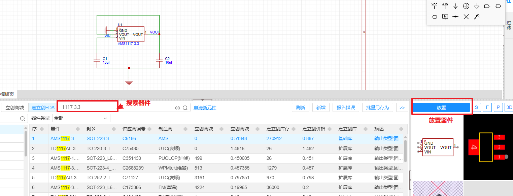

### 初识Arduino

Arduino 是一个受欢迎的开源电子平台，以其易用的硬件和软件而闻名。它特别受到业余爱好者、教育者和原型制作者的青睐，用于创建交互式电子项目。

**Arduino 的关键特性：**

1. **硬件**：Arduino 平台的核心是其系列微控制器板。最常用的板是 Arduino Uno，但还有几种其他变体，设计用于满足不同的需求。这些板配备了一组数字和模拟输入/输出（I/O）引脚，可以与各种扩展板（盾牌）和其他电路接口。

2. **软件**：Arduino 配备了一个用户友好的集成开发环境（IDE），允许用户编写、编译和上传代码到微控制器。编程语言基于 C/C++，对于熟悉这些语言的人来说很直接。

3. **社区和资源**：Arduino 享有庞大且活跃的社区，创作者在此分享项目、扩展并提供支持。丰富的教程、论坛和第三方资源使新手更容易深入电子学。

**Arduino 的应用：**

Arduino 可用于从简单的 DIY 家庭项目到更复杂的科学仪器等广泛的应用。常见项目包括机器人、家庭自动化系统、气象监测设备和互动艺术装置。它能够通过简单的代码与传感器、LED、电机和其他电子组件进行交互，使其成为初学者和专业人士的多功能工具。

**教育工具：**

在教育环境中，Arduino 提供了一个实用的平台，用于教授编程和电子学的原理。它提供了一种实践方法，帮助学生直观地了解软件如何控制硬件，积极地吸引他们学习和实验。

**Arduino 的影响：**

Arduino 平台大大降低了进入电子设计和原型制作的门槛。它继续赋予世界各地的发明家、设计师和制造者权力，使他们能够在不需要广泛的电子知识的情况下将想法变为现实。

总体而言，Arduino 因其简单性、可访问性和广泛的支持社区而受到赞誉，是电子和计算机科学教育领域的重要工具。

### 什么是电路板

PCB（印刷电路板）和PCBA（印刷电路板组装）是与电子电路制造相关的术语，但它们指的是过程的不同阶段。

+ **PCB（印刷电路板）**

  PCB是一种由非导电材料制成的板，其中嵌入了铜制电路层。这种板是大多数电子设备中支持和接线表面贴装和插座组件的物理基础。PCB的设计目的是通过从层压在非导电基材上的铜片中蚀刻出的导电路径或轨迹，来机械支持和电气连接电子组件。

+ **PCBA（印刷电路板组装）**

  PCBA指的是已经装配好所有电子组件的PCB。这意味着在PCB制造完成后，所有组件如晶体管、电阻、二极管和集成电路都被焊接到上面，形成一个功能完整的电子设备。板上组件的装配过程通常通过各种技术进行，如表面贴装技术（SMT）或穿孔技术。

  > **PCB与 PCBA的区别**
  >
  > - **PCB** 是没有任何组件附着的制造板。
  > - **PCBA** 是包括PCB和所有已安装组件的完成的装配体。

从PCB到PCBA的转变涉及装配过程，这是电子设备生产中的一个重要步骤，它将一块裸板转变为能够执行指定电子任务的功能性技术设备。

### 元器件贴装技术

**SMT（表面贴装技术）**

SMT是一种在印刷电路板（PCB）上直接安装组件的方法。使用SMT的组件称为表面贴装设备（SMD），它们比DIP组件小，没有长长的穿过板的引脚。相反，它们有短的引脚或导线，被焊接在板的表面。SMT允许在板的两面放置更多的组件，使得可以构建更紧凑、更高密度的电路。这种方法通常对于大批量生产更快速且更具成本效益。

**DIP（双列直插封装）**

DIP是电子组件的一种封装类型，其特点是有两排平行的电气连接引脚。组件通过钻在PCB上的孔插入，并且引脚在板的另一侧被焊接到焊盘上。DIP组件更大，更易于手动处理和焊接，适合于原型设计和小规模生产。它们也适用于需要拆卸和更换组件的情况，因为它们可以装配到插座连接器中。

> SMT与DIP的区别
>
> + **组件放置**：SMT组件安装在板的表面，而DIP组件则插入PCB的孔中。
> + **大小和密度**：SMT支持更小的组件和更高的电路密度，适合现代紧凑型电子设备。DIP组件更大，占用更多PCB空间。
> + **生产适应性**：由于SMT在效率和劳动成本较低方面的优势，它更受大批量自动生产的青睐。DIP则因其组装和修改更容易，通常用于原型和小批量项目。
> + **组装复杂性**：与DIP相比，SMT需要更复杂的设备和设置进行组装。

总之，选择SMT还是DIP取决于正在制造的电子设备的具体需求，包括大小、生产量和组装技术的考虑。

### 电路设计资源

+ **PCB设计工具**
  AD、PADS、Candence、Kicad、LCEDA等等
+ **器件选型**
  网络搜索、官网、立创商城等
+ **硬件设计参考(器件参数、电路图等)**
  1. 网络搜索
  2. 头部公司规格书参考(TI、ADI、国内中高端品牌等)
  3. 开源硬件平台(立创EDA自带)、其他著名硬件论坛等

### PCB设计工具

+ 单层、双层电路板(快速设计)推荐LCEDA(立创EDA)
+ 立创商城、立创EDA一体，选型到设计一条龙
+ 大部分封装(元器件的PCB样式)不用重新设计，直接使用 
+ 连接嘉立创下单平台后，可以选型、设计、生产一条龙
+ 免费软件，没有版权问题
+ Kicad也是免费软件，但是仅作为PCB设计软件，功能较为单一
+ 其他主流开发软件均为商业软件，价格较贵，有版权问题。

### PCB设计及绘制流程

#### 1. **电路初步设计**

1. **主器件选型及其他器件选型**

   依据电路功能，网上搜索参考电路，确定模块电路的主要器件。电路参考可通过 `Bing图片搜索`、[立创开源硬件库](https://oshwhub.com/)、`元器件产品规格书`进行查找

   

2. **筛选基础库**

   按照原则在立创商城中筛选器件，其中器件选型原则：

   1. 销量
   2. 库存
   3. 封装是否合适

   

   > **点击规格书，规格书关注点：**
   >
   > + 简介，即器件实现的功能
   > + 极限参数 & 推荐工作条件
   > + 参考电路图(可以作为后面原理图的参考)

#### 2. 绘制原理图及PCB绘制工作全流程

**新建工程文件名要求**：字母+数字+下划线，尽量标准化

**工具栏中包括原理图与PCB**

**原理图中添加器件时，搜索时加上'`基础库`'关键字（扩展库SMT贴片需要加钱）**

**工作全流程：**

+ 画原理图

+ 导入pcb

+ 放外框

+ 布局 & 走线（走线时'Tab'可以修改线宽）

> 线宽大小取决于电流大小，线也不是越宽越好，如，高频电路中，线粗了会引入高频干扰（一般不超过焊盘的宽度）

+ 放置接口焊盘

> 过孔：一般内直径3.2mm，外直径5mm

+ 放pcb名称、版本、日期、接口符号正负、输入输出

绘制好的3D电路板展示

