科研工作中，数据是研究的基石。对实验产生的大量数据进行及时而有效的处理，能够充分发挥数据的价值。下面是一些建议，帮助你更好地管理、处理和展示科研数据。

## 数据管理的关键

1. **及时处理实验数据：** 做完实验后立即处理数据，避免长时间后遗忘重要信息。
2. **合理命名文件和文件夹：** 见名知意，避免使用无意义的名称，尽量反映文件内容。
3. **分离软件和数据：** 保存软件和数据的文件夹分开，避免因重新安装软件而重新整理数据。
4. **建立readme.txt文件：** 对于复杂的数据文件夹，创建一个readme.txt，简明扼要描述包含的实验结果，避免遗忘重要信息。
5. **制作汇总PPT：** 汇总主要结果，作为资料库，方便在写文章时查阅，避免频繁查看原始数据。

## 数据分析方法

数据统计图占据figure的半壁江山，咱们随便找两张figure瞅一瞅。10个小figure里有四张都是统计图。8个大figure里有6个都是统计图。

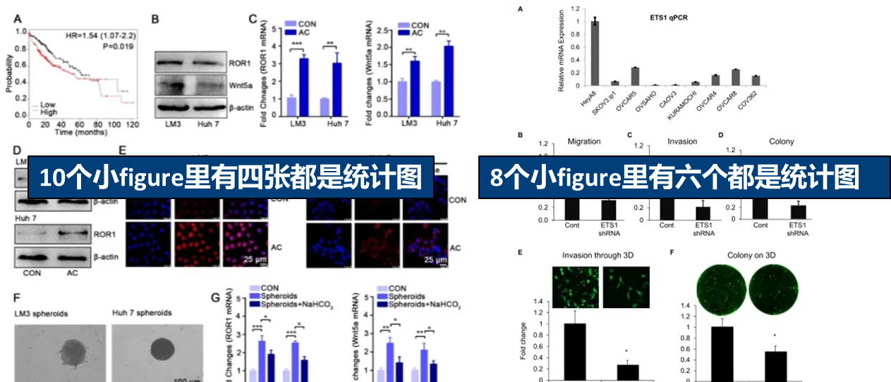

下面是知乎上网友分类汇总学术研究上常用的[数据分析方法](https://www.zhihu.com/search?q=数据分析方法&search_source=Entity&hybrid_search_source=Entity&hybrid_search_extra={"sourceType":"answer","sourceId":3013922259})；比较常用的是前三个

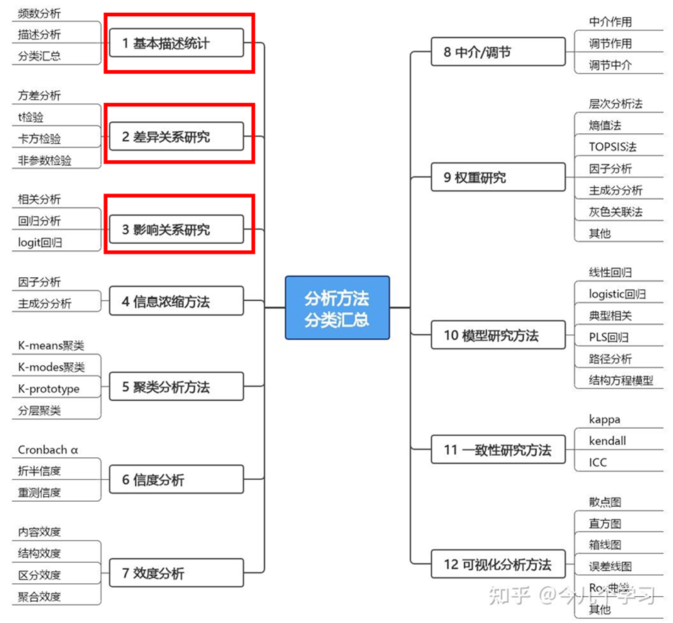

1. 基础描述统计

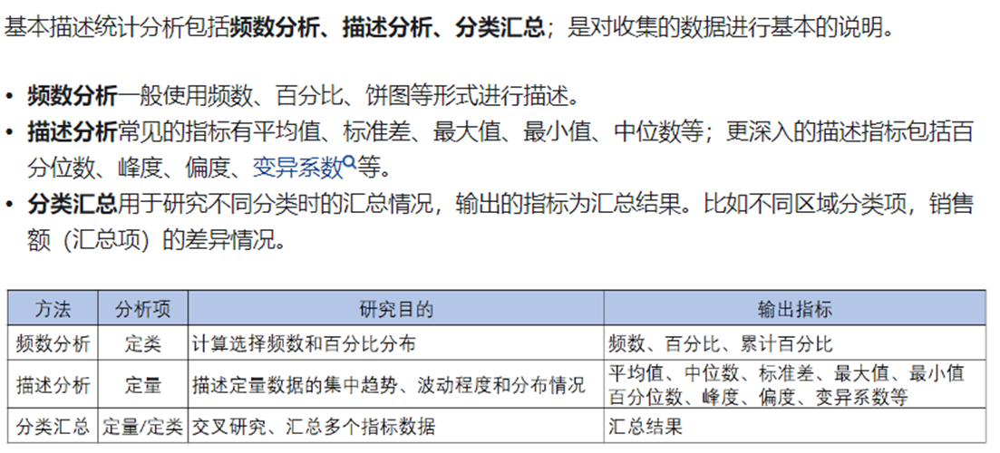

**频数分析**一般使用频数、百分比、饼图等形式进行描述，如我在论文中进行细胞尺寸统计就属于频数分析；

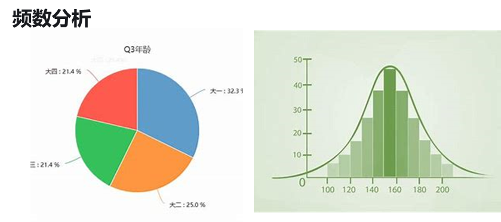

**描述分析**常见的指标有平均值、标准差、最大值、最小值、中位数等，常用的图有柱状图、箱形图、葡萄图、小提琴图，可以根据自己的需求选择相应图形

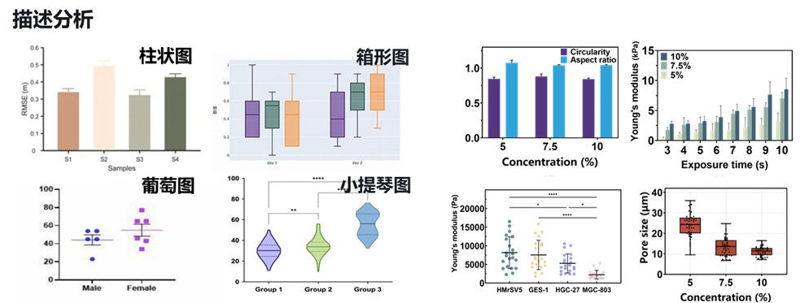

2. **差异关系研究**

常见的差异关系研究方法包括**方差分析、****t****检验、卡方检验、非参数检验****等**。比较常用的是方差分析、t检验，t检验常用于两两之间差异比较；方差分析多用于多组之间差异比较；

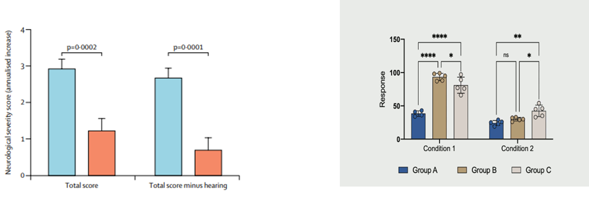

3. **影响关系研究**

影响关系研究包括进行**相关分析、回归分析**，用于研究数据之间的关系。

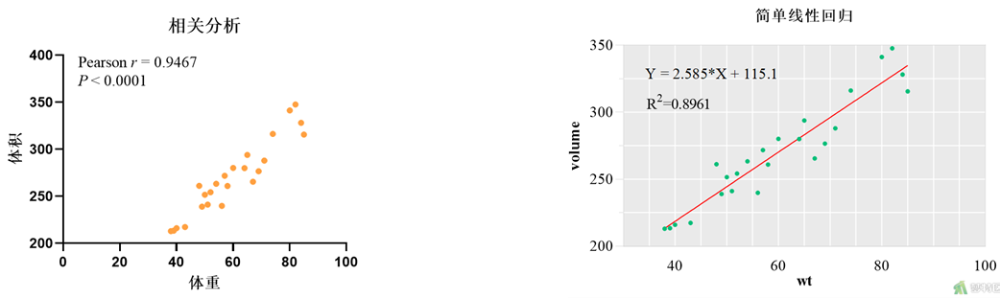

## 科研作图技巧

1. 
2. **建立良好的数据分析文件：** 借鉴程序员在GitHub上的做法，建立readme.md文件或readme.txt文件，方便长期记忆。
3. **配色原则：** 避免使用纯黑白色，避免过高饱和度的彩虹色，使用透明度进行区分，保持整体配色一致。
4. **参考大自然的颜色：** 利用自己喜欢的图片进行吸色，或者借助配色网站选择标号。
5. **避免不必要的背景颜色：** 论文通常采用白色背景，不必要的背景颜色会显得违和。

科研作图一般包括照片及绘图两种，如电镜图、显微镜荧光图等属于前者，这种图处理较少，一般都是加比例尺，电镜图加伪彩；第二种是依据数据绘制得到的图，如前面讲的柱状图，箱型图等；

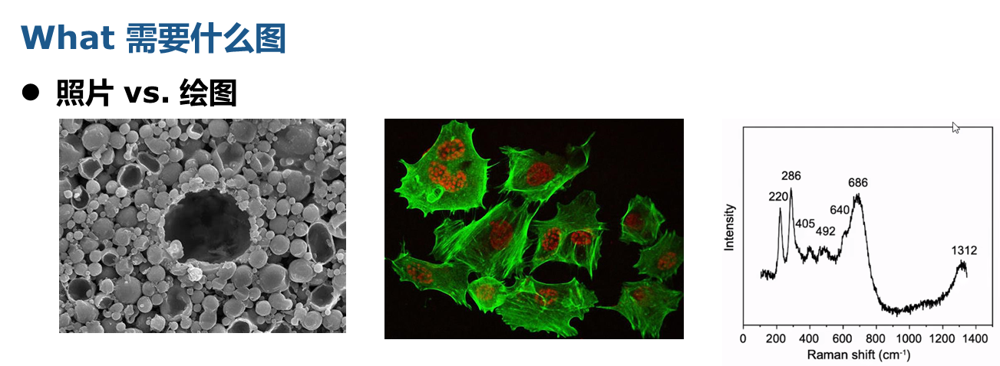

1. **选择合适的作图工具：** Origin、Prism、Python、Matlab等工具都可选，根据个人喜好和需求选择。

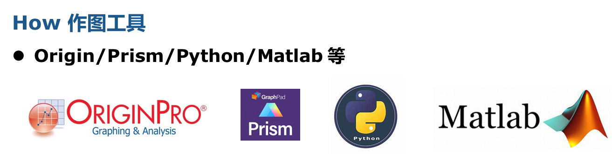

python及matlab数据处理能力也很强大；尤其是python在批量处理文件方面效率很高；有些同学不熟悉python、matlab，没关系，可以求助chatgpt；chatgpt本身还是很强大的，除了大家熟知的论文润色，科研绘图也很强大；教程链接我放左下角，有兴趣可以学习参考

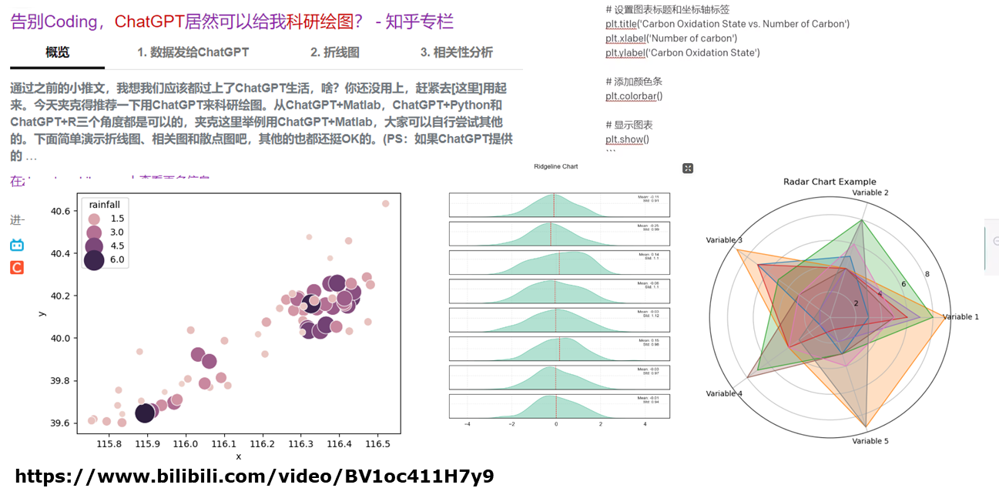

无论用什么数据绘图软件绘制，图的格式都大同小异；好的配色可以帮助论文图提高档次；首先，复杂的图不要使用纯黑白色，会显得单调，增加读者阅读困难；左边的黑不溜秋，易读性大大降低；

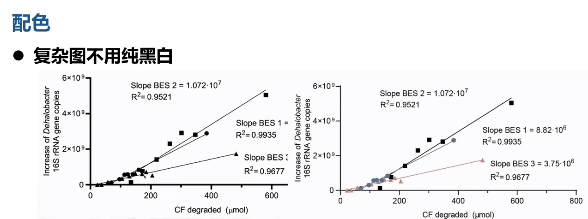

其次，**避免彩虹色，过高饱和度**；高饱和度容易导致视觉疲劳，而低饱和度给人一种沉稳、理智感觉，更适合于科研作图；我在第一版绘图时，使用过多颜色，看起来很混乱。

配色选择；首先可以借助配色网站，直接输入标号即可； 

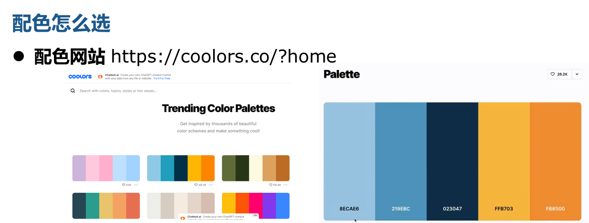

有些同学会说这颜色也不好看，也可以采用吸色的方法；大自然是最好的配色板；照找一张自己喜欢的图片，按其中的颜色进行配色。

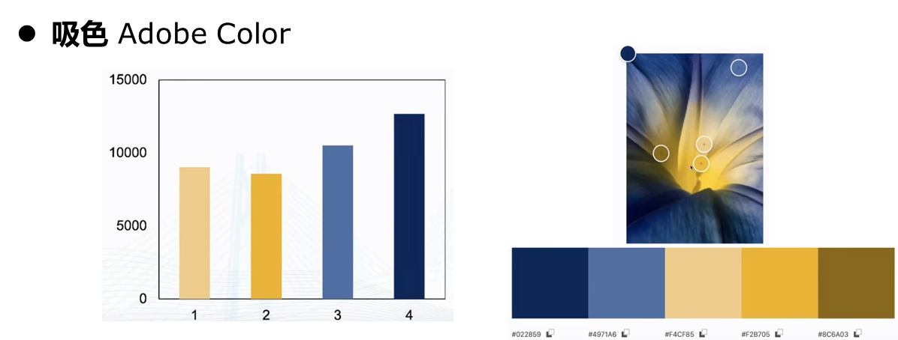

同一子图中如果出现重复坐标，可以考虑合并；不同子图避免合并；比如nature文章中，对f子图中的重复坐标进行合并，g图则没有；

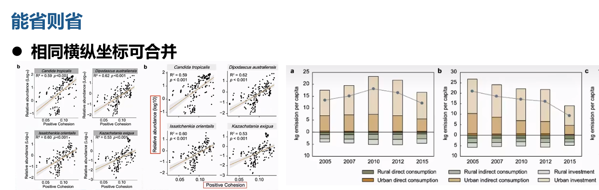

再者，背景颜色没必要，尤其是元素很多的情况下；论文通常是白色背景；带背景颜色的图片放在论文中反而会显得违和

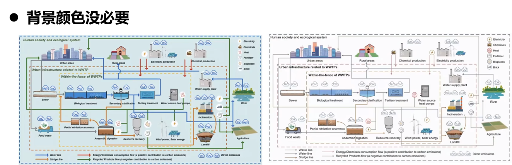

刚刚讲的很多技巧也都是从别人论文里总结出来的，优秀的论文和作品一定是值得学习的

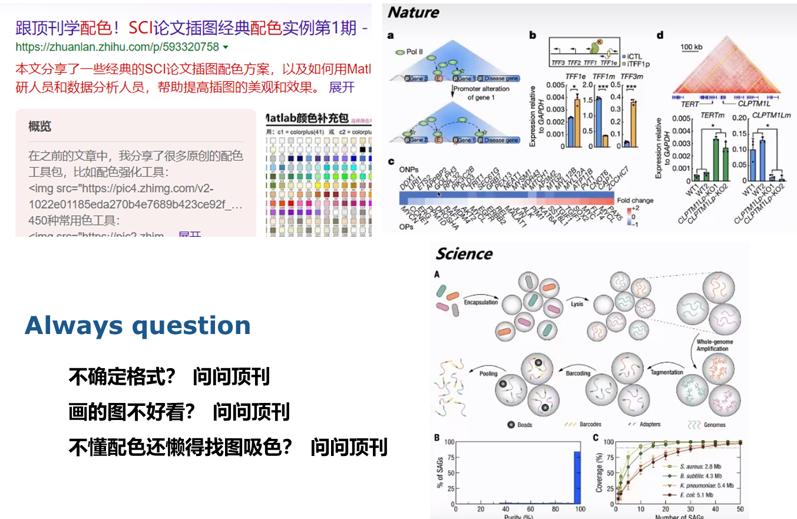
